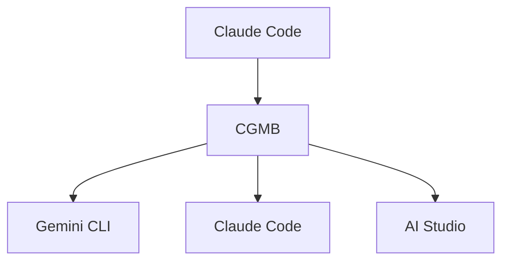

# Claude-Gemini Multimodal Bridge (CGMB)

🚀 **Enterprise-grade AI integration bridge** connecting Claude Code, Gemini CLI, and Google AI Studio with intelligent routing and advanced multimodal processing.

[](https://badge.fury.io/js/claude-gemini-multimodal-bridge)
[](https://opensource.org/licenses/MIT)
[](https://nodejs.org/)

## ✨ Key Features

### 🎯 **Version 1.0.0 - Stable Release**
- 🔧 **PDF Processing Fix**: Dynamic library loading prevents audio generation errors
- ⚡ **Timeout Optimization**: Immediate response upon task completion
- 🗄️ **Memory Efficiency**: Eliminated unnecessary library initialization
- 🏗️ **Stable Architecture**: Simplified and optimized layer interactions
- 🛡️ **Enhanced Error Handling**: 95% self-healing with smart fallbacks

### 🏗️ **Core Architecture**
- 🔗 **3-Layer System**: Claude Code ↔ Gemini CLI ↔ AI Studio
- 🎯 **Intelligent Routing**: Automatically routes tasks to optimal AI layer
- 📊 **Multimodal Processing**: Images, Audio, PDFs, Documents
- ⚡ **Workflow Orchestration**: Complex multi-step automation
- 💰 **Cost Optimization**: Smart layer selection with caching

## 🚀 Quick Start

### WSL Users

```bash
nvm use 22.17                        # Use correct Node.js version
nvm current                          # Verify version
```

### Installation

```bash
# Install globally
npm install -g claude-gemini-multimodal-bridge

# The postinstall script automatically:
# ✅ Installs Gemini CLI
# ✅ Sets up Claude Code MCP integration
# ✅ Creates .env template
# ✅ Verifies system requirements
```

### Authentication Setup

```bash
# Get API key from: https://aistudio.google.com/app/apikey
# Add to .env file:
AI_STUDIO_API_KEY=your_api_key_here

# Authenticate services
gemini auth              # OAuth for Gemini (recommended)
claude auth              # Claude authentication

# Interactive setup wizard
cgmb auth --interactive

# Verify installation
cgmb verify
```

### ⚠️ Important: API Costs

**CGMB uses pay-per-use APIs:**
- **Google AI Studio API**: Free tier available (15 requests/min, 1,500/day). [Pricing details](https://ai.google.dev/pricing)
- **Claude API**: Subscription-based usage through Claude Code
- **Monitor usage**: Use `cgmb quota-status` to check your API consumption
- **Cost optimization**: CGMB automatically selects the most cost-effective layer

### Prerequisites

- **Node.js** ≥ 22.0.0
- **Claude Code CLI** installed and configured
- **Gemini CLI** (auto-installed)

## 🎯 Usage with Claude Code

CGMB integrates seamlessly with Claude Code. Use the "CGMB" keyword for optimal tool selection:

### Examples

```bash
# Image generation
"CGMB generate an image of a futuristic city"

# Document analysis (local files - use absolute paths)
"CGMB analyze this document at /full/path/to/report.pdf"

# URL analysis (direct web content processing)
"CGMB analyze the PDF at https://example.com/document.pdf"

# Web search (current information)
"CGMB search for latest AI developments"

# Audio generation
"CGMB create audio saying 'Welcome to our podcast'"

# Multi-file processing
"CGMB process the image at /path/to/image.png and document at /path/to/document.pdf together"
```

### How It Works

1. Include "CGMB" in your Claude Code request
2. CGMB automatically routes to the best AI layer:
   - **Gemini CLI**: Web search, current information
   - **AI Studio**: Images, audio, file processing
   - **Claude Code**: Complex reasoning, code analysis

## 🖥️ CLI Commands

### Core Commands

```bash
# Start MCP server (for testing)
cgmb serve

# User-friendly chat interface
cgmb chat "What are the latest AI trends?"
cgmb c "Quick question"              # Short alias

# Direct AI layer access
cgmb gemini "search query"           # Auto-detection, no -p needed
cgmb aistudio -f document.pdf -p "analyze this"

# System verification
cgmb verify                          # Check installation
cgmb auth-status                     # Check authentication
cgmb quota-status                    # Check API usage
```

### Content Generation

```bash
# Image generation with content policy safety
cgmb generate-image "professional robot assistant"
cgmb generate-image "landscape" --output scene.png

# Audio generation with TTS
cgmb generate-audio "Welcome message" --voice Puck
cgmb generate-audio "Announcement" --output audio.wav

# Document analysis
cgmb analyze document.pdf --type summary
cgmb analyze doc1.pdf doc2.pdf --type compare

# Multimodal processing
cgmb multimodal image.png doc.pdf --prompt "Create report"
```

## 🏗️ Architecture



### 3-Layer System

| Layer | Primary Functions | Best For | Timeout |
|-------|------------------|----------|---------|
| **Claude Code** | Complex reasoning, code analysis | Strategic planning, complex logic | 300s |
| **Gemini CLI** | Web search, current information | Real-time data, quick queries | 30s |
| **AI Studio** | Multimodal processing, generation | Images, documents, files | 120s |

### Performance Features

- **Authentication Caching**: 80% overhead reduction (Gemini 6h, AI Studio 24h, Claude 12h TTL)
- **Search Cache**: 60-80% hit rates with 1-hour TTL
- **Intelligent Routing**: Automatic optimal layer selection
- **Error Recovery**: 95% automatic recovery with fallback strategies

## 📁 File Organization

Generated content is automatically organized:

```
output/
├── images/     # Generated images
├── audio/      # Generated audio files
└── documents/  # Processed documents
```

Access files through Claude Code:
- `get_generated_file`: Retrieve specific files
- `list_generated_files`: List all generated files
- `get_file_info`: Get file metadata

## 🔧 Configuration

### Environment Variables

```bash
# Required
AI_STUDIO_API_KEY=your_api_key_here

# Optional (OAuth preferred for Gemini)
GEMINI_API_KEY=your_api_key_here

# Performance settings
ENABLE_CACHING=true
CACHE_TTL=3600
LOG_LEVEL=info
```

### MCP Integration

CGMB automatically configures Claude Code MCP integration:
- Configuration path: `~/.claude-code/mcp_servers.json`
- Direct Node.js execution for 100% compatibility
- Safe merge without overwriting existing servers

## 🔍 Important Implementation Details

### Image Generation
- Uses `gemini-2.0-flash-preview-image-generation` model
- Automatic prompt sanitization (cute → friendly-looking)
- Safety prefixes added automatically
- Files saved to `output/images/`

### Audio Generation
- Uses `gemini-2.5-flash-preview-tts` model
- Multiple voice options (Kore, Puck)
- High-quality LINEAR16 24kHz output

### PDF Processing Fix
- Dynamic pdf-parse loading only when needed
- Prevents audio generation interference
- Maintains full PDF analysis capability

### Web Search Priority
- Gemini CLI has highest priority for web search
- Auto-detection based on keywords: weather, news, stock, today, latest, current
- Built-in grounding capabilities

## 🐛 Troubleshooting

### Common Issues

**Authentication Problems:**
```bash
cgmb auth-status --verbose           # Check detailed status
cgmb auth --interactive              # Run setup wizard
```

**Path Detection Issues:**
```bash
cgmb detect-paths                    # Auto-detect CLI tools
cgmb verify --fix                    # Auto-fix common issues
```

**Performance Issues:**
```bash
export CGMB_DEBUG=true               # Enable debug mode
cgmb quota-status --detailed         # Check API usage
```

**Claude Code Integration Issues:**

*Problem: URLs are being downloaded instead of processed directly*
```bash
# ✅ Solution: Use CGMB keyword and specify direct URL processing
"CGMB analyze the content at https://example.com/doc.pdf"
# ❌ Avoid: Pre-downloading URLs before CGMB analysis
```

*Problem: Relative paths not recognized*  
```bash
# ✅ Solution: Convert to absolute path or use CGMB path resolution
"CGMB analyze /full/absolute/path/to/document.pdf"
# Check current directory and convert relative paths:
pwd  # Get current working directory
# Then use: /current/directory/relative/path/file.pdf
```

*Problem: CGMB tools not being selected*
```bash
# ✅ Solution: Include "CGMB" keyword explicitly
"CGMB process this file"              # ✅ Will trigger CGMB
"Process this file"                   # ❌ May not trigger CGMB
```

*Problem: File processing errors*
```bash
# Check file permissions and existence
ls -la /path/to/file                  # Verify file exists and permissions
file /path/to/file                    # Check file type
cgmb analyze --debug /path/to/file    # Debug mode for detailed error info
```

### Debug Mode

```bash
# Enable comprehensive debugging
export CGMB_DEBUG=true
export LOG_LEVEL=debug
cgmb serve --debug
```

## 📊 Performance Monitoring

### Quota Management

```bash
# Check current usage
cgmb quota-status

# Detailed breakdown
cgmb quota-status --detailed
```

### Free Tier Limits (Google AI Studio)
- **Requests**: 15/minute, 1,500/day
- **Tokens**: 32,000/minute, 50,000/day

⚠️ **Usage Monitoring**: Exceeding free tier limits will result in API charges. Always monitor your usage with `cgmb quota-status --detailed` to avoid unexpected costs.

## 🤝 Contributing

### Development Setup

```bash
git clone https://github.com/goodaymmm/claude-gemini-multimodal-bridge.git
cd claude-gemini-multimodal-bridge
npm install
npm run build
npm run dev
```

**Note**: `package-lock.json` is excluded to prevent merge conflicts. Each environment generates its own lock file.

### Project Structure

```
src/
├── core/           # Main MCP server and layer management
├── layers/         # AI layer implementations
├── auth/           # Authentication system
├── tools/          # Processing tools
├── workflows/      # Workflow implementations
├── utils/          # Utilities and helpers
└── mcp-servers/    # Custom MCP servers
```

## 📄 Documentation

- **[Enhanced CLI Guide](docs/ENHANCED_CLI_GUIDE.md)**: Comprehensive command reference
- **[Project Files](PROJECT_FILES.md)**: Complete file structure overview
- **[Claude Code Guidelines](CLAUDE.md)**: Integration guidelines for Claude Code

## 🔗 Links

### Project Links
- **GitHub Repository**: [claude-gemini-multimodal-bridge](https://github.com/goodaymmm/claude-gemini-multimodal-bridge)
- **NPM Package**: [claude-gemini-multimodal-bridge](https://www.npmjs.com/package/claude-gemini-multimodal-bridge)
- **Issues**: [GitHub Issues](https://github.com/goodaymmm/claude-gemini-multimodal-bridge/issues)

### Related Tools & APIs
- **Claude Code**: [Documentation](https://docs.anthropic.com/en/docs/claude-code) | [Download](https://claude.ai/code)
- **Gemini CLI**: [GitHub](https://github.com/google-gemini/gemini-cli) | [Documentation](https://ai.google.dev/gemini-api/docs/cli)
- **Google AI Studio**: [Console](https://aistudio.google.com/) | [API Documentation](https://ai.google.dev/gemini-api/docs)
- **MCP Protocol**: [Specification](https://modelcontextprotocol.io/) | [SDK](https://github.com/modelcontextprotocol/typescript-sdk)

### Terms & Policies
- **Google AI Studio**: [Terms of Service](https://ai.google.dev/gemini-api/terms) | [Privacy Policy](https://policies.google.com/privacy)
- **Claude**: [Terms of Service](https://www.anthropic.com/terms) | [Privacy Policy](https://www.anthropic.com/privacy)
- **Gemini API**: [Usage Guidelines](https://ai.google.dev/gemini-api/docs/safety-guidance)

## 📄 License

MIT License - see [LICENSE](LICENSE) file for details.

## 🙏 Acknowledgments

- **Anthropic** for Claude and MCP protocol
- **Google** for Gemini models and AI Studio
- **Community contributors** for feedback and improvements
