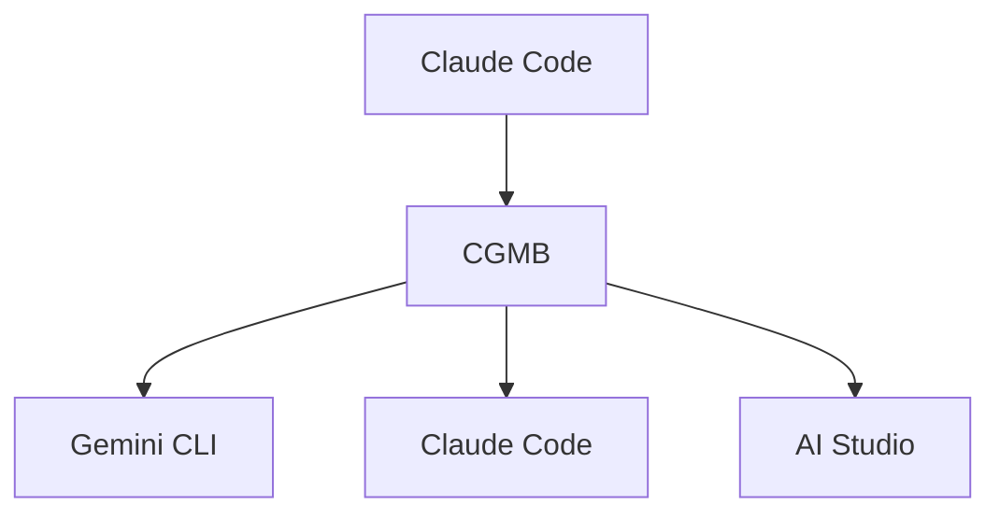

<div align="center">

# 🌉 Claude-Gemini Multimodal Bridge

### *Unifying the Power of AI.*

**An MCP bridge that seamlessly integrates Claude Code, Gemini CLI, and Google AI Studio**

[🇯🇵 日本語版](README_JP.md) • [📦 NPM](https://www.npmjs.com/package/claude-gemini-multimodal-bridge) • [🐛 Issues](https://github.com/goodaymmm/claude-gemini-multimodal-bridge/issues)

---

[](https://www.npmjs.com/package/claude-gemini-multimodal-bridge)
[](https://opensource.org/licenses/MIT)
[](https://nodejs.org/)
[](https://www.typescriptlang.org/)

[](https://modelcontextprotocol.io/)
[](https://ai.google.dev/)
[](https://www.anthropic.com/)
[](https://github.com/sponsors/goodaymmm)

[](#-windows-environment)
[](#-quick-start)
[](#-quick-start)

</div>

---

## 🤔 Why CGMB?

<table>
<tr>
<td width="33%" align="center">

### 🔄 Multi-Model Orchestration

Optimally integrates Claude's **reasoning power**, Gemini CLI's **search capabilities**, and AI Studio's **generation power**. Ahead of the 2026 AI trend: "Specialized AI Collaboration"

</td>
<td width="33%" align="center">

### ⚡ Zero Configuration

Complete with a single `npm install`. Tedious setup is automated

</td>
<td width="33%" align="center">

### 🎯 MCP Standard Compliant

Follows the Anthropic Model Context Protocol. Enterprise-grade reliability with 95% self-healing rate

</td>
</tr>
</table>

---

## ✨ What's New in v1.1.0

| Feature | Description |
|---------|-------------|
| 🪟 **Full Windows Support** | Native support for both CLI and MCP |
| 📝 **Enhanced OCR Processing** | Automatic text extraction from scanned PDFs |
| 🚀 **Latest Gemini Models** | Support for `gemini-2.5-flash`, `gemini-3-flash` |
| 🔐 **OAuth Authentication** | File-based authentication compatible with Claude Code |
| 🌐 **Auto Translation** | Japanese to English translation for image generation |
| 📊 **Smart Routing** | PDF URLs to AI Studio, web pages to Gemini CLI |
| ⚡ **Performance Optimization** | Reduced timeouts, lazy loading, caching |
| 🛡️ **Error Recovery** | 95% self-healing with exponential backoff |

---

## 🏗️ Architecture



| Layer | Specialization | Timeout |
|:-----:|:---------------|:-------:|
| 🔍 Gemini CLI | Web search, real-time information | 30s |
| 🧠 Claude Code | Complex reasoning, code analysis | 300s |
| 🎨 AI Studio | Image generation, audio synthesis, OCR | 120s |

---

## 🚀 Quick Start

### 📋 Prerequisites

- **Node.js** ≥ 22.0.0
- **Claude Code CLI** installed
- **Gemini CLI** (auto-installed)

### 📦 Installation

```bash
npm install -g claude-gemini-multimodal-bridge
```

> 💡 The postinstall script automatically:
> - Installs Gemini CLI
> - Sets up Claude Code MCP integration
> - Creates `.env` template
> - Verifies system requirements

### 🔑 Environment Setup

Create a `.env` file in your working directory:

```bash
AI_STUDIO_API_KEY=your_api_key_here
```

🔗 Get API key: https://aistudio.google.com/app/apikey

### 🎯 Gemini CLI Authentication

```bash
gemini
```

### 💬 Get Started with Claude Code

```
I installed CGMB via NPM. Please check my current environment for the cgmb command and help me use it.
```

---

## 💡 Usage Examples

CGMB integrates seamlessly with Claude Code. Just use the **"CGMB" keyword**:

```bash
# 🎨 Image generation
"CGMB generate an image of a futuristic city"

# 📄 Document analysis (use absolute paths)
"CGMB analyze the document at /full/path/to/report.pdf"

# 🌐 URL analysis
"CGMB analyze https://example.com/document.pdf"

# 🔍 Web search
"CGMB search for the latest AI news"

# 🎵 Audio generation
"CGMB create audio saying 'Welcome to our podcast'"

# 📝 OCR-enabled PDF analysis
"CGMB analyze this scanned PDF document with OCR"
```

### 🔄 Automatic Routing

1. Include **"CGMB"** in your Claude Code request
2. CGMB automatically routes to the optimal AI layer:
   - **🔍 Gemini CLI**: Web search, latest information
   - **🎨 AI Studio**: Images, audio, file processing
   - **🧠 Claude Code**: Complex reasoning, code analysis

---

## 🤖 Models Used

| Purpose | Model ID | Layer |
|:-------:|:---------|:-----:|
| 🔍 Web Search | `gemini-3-flash` | Gemini CLI |
| 🎨 Image Generation | `gemini-2.5-flash-image` | AI Studio |
| 🎵 Audio Generation | `gemini-2.5-flash-preview-tts` | AI Studio |
| 📄 Document Processing | `gemini-2.5-flash` | AI Studio |
| 📝 OCR/Text Extraction | `gemini-2.5-flash` | AI Studio |
| 🔮 General Multimodal | `gemini-2.0-flash-exp` | AI Studio |

---

## 📈 Performance

<table>
<tr>
<td align="center">

### 80%
Authentication Overhead Reduction

</td>
<td align="center">

### 60-80%
Search Cache Hit Rate

</td>
<td align="center">

### 95%
Automatic Error Recovery Rate

</td>
</tr>
</table>

---

## 📄 PDF Processing & OCR

### ✨ OCR Features

- ✅ Supports both text-based and scanned PDFs
- ✅ Automatic OCR detection
- ✅ Native OCR processing via Gemini File API
- ✅ Multi-language support

### 📋 Processing Workflow

```
PDF Input → Upload → OCR Processing → Content Analysis → Output Results
```

### 📁 Supported Formats

- Text-based PDFs
- Scanned PDFs (OCR processing)
- Image-based PDFs (OCR conversion)
- Mixed content
- Complex layouts (tables, charts, formatted content)

---

## 📂 File Organization

Generated content is automatically organized:

```
output/
├── images/     # 🎨 Generated images
├── audio/      # 🎵 Generated audio files
└── documents/  # 📄 Processed documents
```

Access via Claude Code:
- `get_generated_file`: Retrieve specific files
- `list_generated_files`: List all generated files
- `get_file_info`: Get file metadata

---

## 🔧 Configuration

### Environment Variables

```bash
# Required
AI_STUDIO_API_KEY=your_api_key_here

# Optional
GEMINI_API_KEY=your_api_key_here
ENABLE_CACHING=true
CACHE_TTL=3600
LOG_LEVEL=info
```

### MCP Integration

CGMB automatically configures Claude Code MCP integration:
- 📍 Config path: `~/.claude-code/mcp_servers.json`
- ⚡ Direct Node.js execution
- 🔒 Safe merge without overwriting existing servers

---

## 🪟 Windows Environment

CGMB **fully supports** Windows in v1.1.0:

| Feature | Status |
|---------|:------:|
| CLI | ✅ All commands work |
| MCP Integration | ✅ MCP tool calls work correctly |
| Path Resolution | ✅ Automatically handles `C:\path\to\file` format |
| Gemini CLI | ✅ Full compatibility with Windows version |

```powershell
# Absolute paths recommended
cgmb analyze "C:\Users\name\Documents\report.pdf"

# Set environment variable (PowerShell)
$env:AI_STUDIO_API_KEY = "your_api_key_here"

# Set environment variable (Command Prompt)
set AI_STUDIO_API_KEY=your_api_key_here
```

---

## 🐧 Linux / WSL Environment

CGMB **works fully** on Linux and WSL:

| Feature | Status |
|---------|:------:|
| CLI | ✅ All commands work |
| MCP Integration | ✅ MCP tool calls work correctly |
| Path Resolution | ✅ Supports `/mnt/` WSL paths and Unix paths |
| Gemini CLI | ✅ Full compatibility with Linux version |

```bash
# Use Unix path format
cgmb analyze /home/user/documents/report.pdf

# WSL environment example
cgmb analyze /mnt/c/Users/name/Documents/report.pdf

# Set environment variables
export AI_STUDIO_API_KEY="your_api_key_here"
export CGMB_CHAT_MODEL="gemini-2.5-flash"
```

---

## 🔍 Troubleshooting

### Debug Mode

```bash
export CGMB_DEBUG=true
export LOG_LEVEL=debug
cgmb serve --debug
```

### OCR and PDF Processing Issues

**If OCR results are inaccurate:**
- Use high-resolution scanned PDFs (300+ DPI)
- Ensure clear, high-contrast text
- Avoid skewed or rotated documents

**If large documents timeout:**
- Split large PDFs before processing (limit: 50MB, 1,000 pages)
- Extend timeout: `export AI_STUDIO_TIMEOUT=180000`

---

## 💰 API Costs

CGMB uses pay-per-use APIs:
- 📊 [Google AI Studio API Pricing Details](https://ai.google.dev/pricing)

---

## 📁 Project Structure

```
src/
├── core/           # 🎯 Main MCP server and layer management
├── layers/         # 🔌 AI layer implementations
├── auth/           # 🔐 Authentication system
├── tools/          # 🛠️ Processing tools
├── workflows/      # 📋 Workflow implementations
├── utils/          # 🔧 Utilities and helpers
└── mcp-servers/    # 🌐 Custom MCP servers
```

---

## 🔗 Links

<table>
<tr>
<td>

### 📦 Project
- [GitHub](https://github.com/goodaymmm/claude-gemini-multimodal-bridge)
- [NPM](https://www.npmjs.com/package/claude-gemini-multimodal-bridge)
- [Issues](https://github.com/goodaymmm/claude-gemini-multimodal-bridge/issues)

</td>
<td>

### 🔧 Related Tools
- [Claude Code](https://docs.anthropic.com/en/docs/claude-code)
- [Gemini CLI](https://github.com/google-gemini/gemini-cli)
- [Google AI Studio](https://aistudio.google.com/)
- [MCP](https://modelcontextprotocol.io/)

</td>
<td>

### 📜 Terms of Service
- [Google AI Studio](https://ai.google.dev/gemini-api/terms)
- [Claude](https://www.anthropic.com/terms)
- [Gemini API](https://ai.google.dev/gemini-api/docs/safety-guidance)

</td>
</tr>
</table>

---

## 📜 Version History

### v1.1.0 (2026-01-10)
- 🪟 **Full Windows Support**: Native Windows support for both CLI and MCP
- 📝 **Enhanced OCR**: Automatic OCR processing for image-based PDFs
- 🚀 **Latest Gemini Models**: Support for gemini-2.5-flash, gemini-3-flash
- ⚡ **Improved MCP Integration**: Optimized async layer initialization
- 📈 **Performance Improvements**: Reduced timeouts, lazy loading, enhanced caching
- 🛡️ **Error Recovery**: 95% self-healing rate with exponential backoff

### v1.0.4
- 🎉 Initial release
- 🏗️ 3-layer architecture implementation
- 🎨 Basic multimodal processing

---

<div align="center">

## 📄 License

MIT - See [LICENSE](LICENSE)

---

**Made with ❤️ by [goodaymmm](https://github.com/goodaymmm)**

*⭐ If this project helped you, please give it a star!*

[](https://github.com/sponsors/goodaymmm)

</div>
