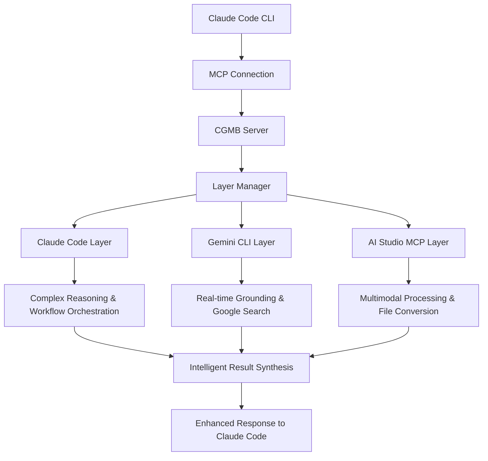

# Claude-Gemini Multimodal Bridge (CGMB)

🚀 **Multi-layer AI integration bridge** connecting Claude Code, Gemini CLI, and Google AI Studio for advanced multimodal processing

[](https://badge.fury.io/js/claude-gemini-multimodal-bridge)
[](https://opensource.org/licenses/MIT)
[](https://nodejs.org/)

## ✨ Features

### 🆕 **New in Latest Version (v1.0.0)**
- 🚀 **Enhanced CLI Commands**: Direct access to all AI layers without complex workflows
- ✅ **Fixed Error.md Issues**: No more "unknown command" errors or timeout problems  
- 🔧 **Resolved AI Studio Integration**: Direct API access bypassing MCP server dependencies
- 🎯 **Streamlined Gemini CLI**: Seamless search and grounding functionality
- 📊 **Production-Ready**: Complete test suite, linting, and dependency verification
- 🛡️ **Improved Authentication**: Auto-fix capabilities and better error diagnostics
- ⚡ **Real Multimodal Processing**: Actual content generation and analysis (not just initialization)

### 🏗️ **Core Features**
- 🔗 **3-Layer Architecture**: Claude Code ↔ Gemini CLI ↔ AI Studio
- 🎯 **Adaptive Execution**: Automatically routes tasks to optimal AI layer
- 📊 **Multimodal Processing**: Images, Audio, PDFs, Documents
- ⚡ **Workflow Orchestration**: Complex multi-step automation
- 🛡️ **Robust Error Handling**: Fallback strategies & retry logic
- 🔧 **Extensible Design**: Easy to add new layers and tools
- 💰 **Cost Optimization**: Smart layer selection for efficiency
- 🔄 **Real-time Processing**: Streaming responses and parallel execution

## 🏗️ Architecture

CGMB operates as an **MCP (Model Context Protocol) server** that seamlessly integrates three powerful AI layers. Claude Code connects to CGMB via MCP, enabling transparent enhancement of your existing workflows.



### How It Works

1. **MCP Integration**: CGMB runs as an MCP server that Claude Code can connect to
2. **Transparent Enhancement**: Your existing Claude Code workflows remain unchanged
3. **Intelligent Routing**: CGMB automatically routes tasks to the optimal AI layer
4. **Unified Results**: All responses are synthesized and returned through Claude Code

### Layer Responsibilities

| Layer | Primary Functions | Best For |
|-------|------------------|----------|
| **Claude Code** | Complex reasoning, workflow orchestration, code analysis | Strategic planning, complex logic |
| **Gemini CLI** | Grounding, search, rapid processing | Real-time data, command execution |
| **AI Studio MCP** | Multimodal processing, file conversion | Images, audio, PDFs, documents |

📖 **API Key Setup Guides:**
- [Gemini API Key Guide](https://ai.google.dev/gemini-api/docs/api-key)
- [Create AI Studio API Key](https://aistudio.google.com/app/apikey)

## 🚀 Quick Start

> **WSL Users**: Run `nvm use 22.17` before installation if you encounter version errors.

#### **Windows WSL Users**
If you're using Windows WSL and encounter Node.js version or permission issues:

```bash
# Switch to required Node.js version
nvm use 22.17  # or any 22.x version
nvm current    # Verify version
```

### ✨ **Automatic Installation (Recommended)**

🎉 **One-command setup** with automatic dependency resolution and MCP integration:

```bash
# Automatic installation with postinstall magic
npm install -g claude-gemini-multimodal-bridge

# That's it! The postinstall script automatically:
# ✅ Installs Gemini CLI (@google/gemini-cli)
# ✅ Installs AI Studio MCP Server (aistudio-mcp-server)  
# ✅ Sets up Claude Code MCP integration
# ✅ Creates .env template file
# ✅ Verifies system requirements
```

### 🔧 **Interactive Setup**

After installation, run the guided authentication setup:

```bash
# Interactive authentication wizard
cgmb auth --interactive

# This will guide you through:
# 1. Gemini CLI OAuth authentication
# 2. AI Studio API key setup
# 3. Claude Code verification
# 4. MCP integration confirmation
```

### 📋 **Manual Installation (If Needed)**

If automatic installation fails, you can install manually:

```bash
# Install required components
npm install -g @anthropic-ai/claude-code
npm install -g @google/gemini-cli
npm install -g aistudio-mcp-server

# Clone and build CGMB
git clone https://github.com/goodaymmm/claude-gemini-multimodal-bridge.git
cd claude-gemini-multimodal-bridge
npm install && npm run build && npm link
```

### 🔑 **Authentication Setup**

Get your API key from [Google AI Studio](https://aistudio.google.com/app/apikey):

```bash
# Set your API key (NEW variable name)
# Open .env file with text editor and add:
# AI_STUDIO_API_KEY=your_key_here

# Authenticate Gemini CLI (OAuth recommended)
gemini auth  # Follow browser authentication flow
```

### Prerequisites

- **Node.js** ≥ 22.0.0 (Recommended: 22.17+)
- **Claude Code CLI** installed and configured
- **Gemini CLI** installed


**Note**: WSL environments may have multiple Node.js installations. Always use nvm to ensure the correct version.

### Authentication Requirements

#### **AI Studio (Required for Generation Features)**
- **Purpose**: Image/video/audio generation, multimodal file processing
- **Method**: API Key from Google AI Studio
- **Setup**: Get your key from [https://aistudio.google.com/app/apikey](https://aistudio.google.com/app/apikey)
- **Environment**: Set `AI_STUDIO_API_KEY` in your `.env` file

#### **Gemini CLI (Required for Real-time Features)**
- **Purpose**: Real-time search, grounding, rapid text processing
- **Method**: OAuth (Recommended) via `gemini auth` command
- **Setup**: Run `gemini auth` and follow browser authentication
- **Note**: No environment variable needed - uses OAuth token automatically

#### **Claude Code (Required for All Features)**
- **Purpose**: Complex reasoning, workflow orchestration, code analysis
- **Method**: Session authentication via `claude auth`
- **Setup**: Run `claude auth` when prompted
- **Note**: Independent authentication system

### Setup

```bash
# 1. Get API key from: https://aistudio.google.com/app/apikey
# Add to .env file:
# Open .env file with text editor and add:
# AI_STUDIO_API_KEY=your_api_key_here

# 2. Run setup wizard (creates .env configuration)
cgmb setup

# 3. Configure Claude Code MCP integration
cgmb setup-mcp
# This automatically adds CGMB as an MCP server to Claude Code

# 4. Verify everything is working
cgmb verify
# This checks system requirements, authentication, and MCP configuration

# 5. Restart Claude Code to load MCP integration
# Then use Claude Code normally with enhanced capabilities!
claude "Hello! Test the enhanced capabilities."
```

**Automated MCP Integration**: CGMB now automatically configures Claude Code's MCP settings safely without overwriting existing configurations.

## 🚀 Enhanced CLI Commands

### Direct Layer Access (NEW!)

```bash
# Direct Gemini CLI with search and grounding
cgmb gemini -p "Latest AI trends in 2024-2025" --search

# Direct AI Studio for multimodal processing  
cgmb aistudio -p "Create business infographic" -f image1.png document.pdf

# Intelligent layer routing for complex tasks
cgmb process -p "Comprehensive market analysis" -w analysis -f data.csv --strategy adaptive

# Enhanced testing with actual processing
cgmb test -p "Analyze this content" -f document.pdf --timeout 180000
```

### Key Improvements Over Previous Versions

| Issue (Error.md/Error2.md/Error3.md) | Solution |
|---------------------------------------|----------|
| ❌ "unknown command 'gemini-chat'" | ✅ `cgmb gemini -p "question"` |
| ❌ Commands timeout during initialization | ✅ Actual processing with results |
| ❌ AI Studio MCP server failures | ✅ Direct API integration |
| ❌ Complex multi-step workflows | ✅ Single command execution |
| ❌ No real search/grounding | ✅ Built-in search functionality |

### Command Reference

| Command | Purpose | Example |
|---------|---------|---------|
| `cgmb gemini` | Direct Gemini CLI access | `cgmb gemini -p "question" --search` |
| `cgmb aistudio` | AI Studio multimodal processing | `cgmb aistudio -p "create image" -f file.txt` |
| `cgmb process` | Intelligent layer routing | `cgmb process -p "analyze" -w analysis` |
| `cgmb test` | Enhanced testing | `cgmb test -p "test prompt" -f file.pdf` |
| `cgmb verify` | System verification | `cgmb verify --fix` |

### Configuration

Copy `.env.example` to `.env` and configure:

```bash
# ===== AI Studio Authentication =====
# Required for image/video/audio generation and multimodal processing
# Get your API key from: https://aistudio.google.com/app/apikey
AI_STUDIO_API_KEY=your_ai_studio_api_key_here

# ===== Gemini CLI Authentication =====
# Primary method: OAuth (run: gemini auth)
# No API key needed - uses OAuth token automatically

# ===== Claude Code Authentication =====
# Run: claude auth (no environment variable needed)
CLAUDE_API_KEY=your_claude_api_key_here_optional  # Only if using Claude API directly

# CLI Tool Paths (Auto-detected if in PATH)
CLAUDE_CODE_PATH=/usr/local/bin/claude
GEMINI_CLI_PATH=/usr/local/bin/gemini

# Processing Options
GEMINI_MODEL=gemini-2.5-pro
DEFAULT_LAYER_PRIORITY=adaptive
ENABLE_CACHING=true
```

**⚠️ Migration Note**: If you're upgrading from a previous version, rename `GEMINI_API_KEY` to `AI_STUDIO_API_KEY` in your `.env` file for clarity.


## 📖 Usage

### Simple Usage with Claude Code

Once set up, CGMB enhances Claude Code transparently:

```bash
# Image generation with AI Studio (Imagen 3)
claude "Generate an image of a futuristic city"

# Document analysis with multimodal processing
claude "Analyze this image and describe what you see @image.png"
claude "Summarize this PDF document @document.pdf"

# Real-time information with Gemini grounding
claude "What are the latest developments in AI technology?"

# Complex file conversion
claude "Convert this spreadsheet to markdown format @data.xlsx"
```

**Enhanced with AI Studio Priority**: Image/video/audio generation now routes to AI Studio (Imagen 3, Veo 2) instead of Gemini 2.0 Flash for superior quality.

### Working Outside Project Directory

**Method A: Global Installation (Recommended)**
```bash
# 1. One-time setup in CGMB directory
cd /path/to/claude-gemini-multimodal-bridge
npm link

# 2. Now you can work from any directory
cd /any/project/directory
cgmb serve

# 3. Use Claude Code normally with enhanced capabilities
claude "your request"  # CGMB-enhanced processing
```

**Benefits:**
- ✅ Use CGMB from any directory
- ✅ No need to copy files or change directory
- ✅ Global `cgmb` command available system-wide
- ✅ Automatic enhancement of Claude Code workflows

### How It Works

When you use Claude Code with CGMB connected:

1. **Automatic Enhancement**: CGMB detects what type of task you're doing
2. **Smart Routing**: Routes to the best AI layer (Claude Code, Gemini CLI, or AI Studio)
3. **Transparent Results**: You get enhanced capabilities without learning new commands

### Enhanced Capabilities

| Input Type | CGMB Enhancement | Example |
|------------|------------------|---------|
| **Images** | Advanced visual analysis | `claude "Analyze this chart @chart.png"` |
| **PDFs** | Full document processing | `claude "Extract tables from @report.pdf"` |
| **Audio** | Transcription + analysis | `claude "Transcribe and summarize @meeting.mp3"` |
| **Current Info** | Real-time search | `claude "Latest news about quantum computing"` |
| **Complex Tasks** | Multi-layer processing | `claude "Compare these 3 documents @doc1.pdf @doc2.pdf @doc3.pdf"` |

### Advanced Workflow Example

```typescript
// Custom workflow definition
const workflow = {
  steps: [
    {
      id: "extract_text",
      layer: "aistudio", 
      action: "convert_pdf_to_text",
      input: { files: "@input.files" }
    },
    {
      id: "analyze_content",
      layer: "claude",
      action: "complex_analysis", 
      input: { 
        text: "@extract_text.output",
        analysis_type: "sentiment_and_themes"
      },
      dependsOn: ["extract_text"]
    },
    {
      id: "generate_summary",
      layer: "gemini",
      action: "create_summary",
      input: {
        analysis: "@analyze_content.output",
        format: "executive_summary"
      },
      dependsOn: ["analyze_content"]
    }
  ]
};
```

### Workflow Types

| Type | Description | Use Cases |
|------|-------------|-----------|
| `analysis` | Multi-layer content analysis | Research, insights, evaluation |
| `conversion` | File format conversion | PDF→Markdown, image processing |
| `extraction` | Data extraction from files | Tables, text, metadata |
| `generation` | Content creation | Reports, summaries, presentations |

## 📊 Quota Monitoring & Management

CGMB includes comprehensive API quota monitoring to help you stay within free tier limits and avoid unexpected charges.

### Free Tier Limits (Google AI Studio)

- **Requests**: 15/minute, 1,500/day
- **Tokens**: 32,000/minute, 50,000/day

### Quota Commands

```bash
# Check current quota usage
cgmb quota-status

# Detailed quota breakdown
cgmb quota-status --detailed
```

### Automatic Quota Management

- **Pre-request Validation**: Checks quota before making API calls
- **Smart Warnings**: Alerts at 80% and 90% usage thresholds  
- **Automatic Blocking**: Prevents requests that would exceed limits
- **Reset Tracking**: Monitors daily and per-minute reset times

### Quota Status Examples

```bash
📊 Google AI Studio API Quota Status
=====================================
Tier: FREE

✅ Requests (Daily): 45/1500 (3%)
   Remaining: 1455
   Reset in: 18h

✅ Tokens (Daily): 12450/50000 (25%)
   Remaining: 37550

✅ Overall Status: HEALTHY
```

## 🛠️ API Reference

### Core Tools

#### `multimodal_process`
Process multimodal content through the 3-layer pipeline.

```json
{
  "prompt": "string",
  "files": [{"path": "string", "type": "image|audio|pdf|document"}],
  "workflow": "analysis|conversion|extraction|generation",
  "options": {
    "layer_priority": "claude|gemini|aistudio|adaptive",
    "execution_mode": "sequential|parallel|adaptive", 
    "quality_level": "fast|balanced|quality"
  }
}
```

#### `document_analysis`
Advanced document analysis combining all layers.

```json
{
  "documents": ["string"],
  "analysis_type": "summary|comparison|extraction|translation",
  "output_requirements": "string"
}
```

#### `workflow_orchestration`
Execute complex multi-step workflows.

```json
{
  "workflow_definition": {
    "steps": [/* WorkflowStep[] */],
    "fallbackStrategies": {/* ... */}
  },
  "input_data": {/* any */},
  "execution_mode": "sequential|parallel|adaptive"
}
```

## 🔧 CLI Command Reference

### Core Commands

#### `cgmb serve`
Start the CGMB MCP server for integration with Claude Code.

```bash
cgmb serve                     # Start server with default settings
cgmb serve --verbose          # Enable verbose logging
cgmb serve --debug            # Enable debug logging
cgmb serve -c /path/to/.env   # Use specific configuration file
```

**Process Management:**
- Server runs continuously until manually stopped (Ctrl+C)
- Automatic graceful shutdown handling
- Environment variables loaded from multiple search paths
- Supports directory-independent execution

---

#### `cgmb setup`
Initial setup wizard for CGMB dependencies and configuration.

```bash
cgmb setup                     # Run complete setup
cgmb setup --force            # Force reinstall dependencies
```

**Setup Tasks:**
- ✅ Verifies Node.js version (≥22.0.0)
- ✅ Checks for Claude Code and Gemini CLI
- ✅ Creates .env configuration file from template
- ✅ Creates logs directory structure
- ✅ Provides next steps guidance

---

#### `cgmb verify`
Comprehensive system verification and health check command.

```bash
cgmb verify                    # Standard verification
cgmb verify --fix             # Auto-fix authentication issues
```

**Verification Checks:**
- ✅ **System Requirements**: Node.js version, dependencies
- ✅ **CLI Tools**: Claude Code, Gemini CLI availability  
- ✅ **Authentication**: All service authentication status
- ✅ **MCP Integration**: Claude Code MCP configuration
- ✅ **Server Health**: CGMB server initialization test

**Auto-Fix Features (`--fix`):**
- 🔧 **Authentication Repair**: Automatically runs `cgmb auth --interactive`
- 🔧 **Path Detection**: Helps resolve CLI tool path issues
- 🔧 **Configuration**: Guides through missing setup steps

**Exit Codes:**
- `0`: All checks passed, system ready
- `1`: Some checks failed, manual intervention needed

**Example Output:**
```
🔍 Verifying CGMB installation and authentication...

📋 System Requirements Check:
✓ Node.js version
✓ Project dependencies
✓ Claude Code CLI
✓ Gemini CLI

🔐 Authentication Verification:
✅ Gemini: Authenticated
✅ Claude: Authenticated  
✅ Aistudio: Authenticated

🔗 MCP Configuration Verification:
✅ Claude Code MCP Integration: Configured
   Command: node
   Args: /path/to/cgmb/dist/index.js

🚀 Testing server initialization...
✓ Server initialization test passed

🎉 All verification checks passed!
✨ CGMB is ready to use!
💡 Try: cgmb serve
```

---

### Authentication Commands

#### `cgmb auth`
Manage authentication for all AI services.

```bash
cgmb auth                           # Full authentication setup wizard
cgmb auth --interactive            # Interactive authentication setup
cgmb auth --service gemini         # Setup specific service
cgmb auth --service aistudio       # Setup AI Studio authentication
cgmb auth --method oauth           # Use OAuth method
cgmb auth --method apikey          # Use API key method
```

**Supported Services:**
- **Gemini**: OAuth (recommended) or API key
- **AI Studio**: API key (same as Gemini)
- **Claude**: OAuth through Claude Code CLI

---

#### `cgmb auth-status`
Check authentication status for all services.

```bash
cgmb auth-status                    # Basic status check
cgmb auth-status --verbose         # Detailed authentication info
```

**Example Output:**
```
🔐 Authentication Status Report

══════════════════════════════════════════════════

✅ Gemini: Authenticated
   Method: oauth
   User: user@example.com
   Quota: 1450 requests remaining

✅ Aistudio: Authenticated
   Method: api_key
   Plan: FREE

✅ Claude: Authenticated

══════════════════════════════════════════════════
Overall Status: 🟢 READY

💡 Recommendations:
   • OAuth authentication provides better quota limits
   • Consider upgrading to paid plan for higher limits
```

---

#### `cgmb setup-guide`
Display comprehensive authentication setup guide.

```bash
cgmb setup-guide               # Show step-by-step setup instructions
```

---

### MCP Integration Commands

#### `cgmb setup-mcp`
Configure Claude Code MCP integration for CGMB automatically.

```bash
cgmb setup-mcp                     # Automatic MCP configuration
cgmb setup-mcp --force            # Force update existing config
cgmb setup-mcp --dry-run          # Show what would be done
cgmb setup-mcp --manual           # Show manual setup instructions
```

**Features:**
- ✅ **Safe Configuration**: Automatically backs up existing MCP settings
- ✅ **Merge Strategy**: Adds CGMB without overwriting other MCP servers
- ✅ **Auto-Detection**: Finds Claude Code configuration directory automatically
- ✅ **Rollback Support**: Creates timestamped backups for safety

**Example Output:**
```
🔧 Setting up Claude Code MCP integration...

📊 Current MCP Configuration Status
════════════════════════════════════════
Configuration Path: ~/.claude-code/mcp_servers.json
CGMB Configured: ❌ No

✅ Successfully added CGMB MCP configuration
📁 Configuration file: ~/.claude-code/mcp_servers.json
💾 Backup created: ~/.claude-code/mcp_servers.json.backup.2025-06-30T03-15-30-000Z

🎉 Setup Complete!

Next steps:
1. Restart Claude Code to load the new MCP configuration
2. Run "cgmb verify" to test the connection
3. Check that CGMB tools are available in Claude Code
```

---

#### `cgmb mcp-status`
Check Claude Code MCP configuration status.

```bash
cgmb mcp-status                    # Check current MCP configuration
```

**Example Output:**
```
📊 Claude Code MCP Configuration Status
══════════════════════════════════════════════════

Configuration Path: ~/.claude-code/mcp_servers.json
CGMB Configured: ✅ Yes

🔧 Current CGMB Configuration:
   Command: node
   Arguments: /usr/local/lib/node_modules/claude-gemini-multimodal-bridge/dist/index.js
   Environment: NODE_ENV

💡 Recommendations:
   • CGMB MCP integration is properly configured
   • Consider installing CGMB globally for better performance
```

---

### Monitoring Commands

#### `cgmb quota-status`
Monitor Google AI Studio API quota usage.

```bash
cgmb quota-status                  # Basic quota status
cgmb quota-status --detailed       # Detailed quota breakdown
```

**Example Output:**
```
📊 Google AI Studio API Quota Status
=====================================
Tier: FREE

✅ Requests (Daily): 45/1500 (3%)
   Remaining: 1455
   Reset in: 18h

✅ Tokens (Daily): 12450/50000 (25%)
   Remaining: 37550

✅ Overall Status: HEALTHY
```

---

#### `cgmb detect-paths`
Detect and verify CLI tool installations.

```bash
cgmb detect-paths                  # Detect tool paths
cgmb detect-paths --fix           # Attempt to fix PATH issues
```

---

#### `cgmb info`
Display CGMB system information.

```bash
cgmb info                          # Basic system info
cgmb info --env                   # Detailed environment info
```

---

### Testing Commands

#### `cgmb test`
Run test multimodal processing request.

```bash
cgmb test                          # Basic functionality test
cgmb test --file image.png         # Test with specific file
cgmb test --prompt "Custom prompt" # Test with custom prompt
```

## 📊 Performance & Optimization

### Adaptive Layer Selection

CGMB automatically selects the optimal layer based on:

- **Task complexity**: Simple → Gemini, Complex → Claude
- **Content type**: Multimodal → AI Studio, Text → Gemini
- **Real-time needs**: Urgent → Gemini CLI, Quality → Claude
- **Cost considerations**: Budget-conscious routing

### Caching Strategy

```bash
# Enable intelligent caching
ENABLE_CACHING=true
CACHE_TTL=3600  # 1 hour

# Cache hit rates typically 40-60% for repeated operations
```

### Cost Optimization

- **Free Tier Usage**: Maximizes free quotas across all services
- **Smart Routing**: Routes simple tasks to free/cheaper layers
- **Batch Processing**: Combines multiple operations when possible

## 🔧 Advanced Configuration

### Layer-Specific Settings

```bash
# Claude Code Layer
CLAUDE_CODE_TIMEOUT=300000
CLAUDE_ENABLE_DANGEROUS_MODE=false

# Gemini CLI Layer  
GEMINI_MODEL=gemini-2.5-pro
GEMINI_TIMEOUT=60000
GEMINI_USE_SEARCH=true

# AI Studio Layer
AISTUDIO_MAX_FILES=10
AISTUDIO_MAX_FILE_SIZE=100
AISTUDIO_ENABLE_VISION=true
```

### Custom Workflows

```typescript
import { LayerManager, ExecutionPlan } from 'claude-gemini-multimodal-bridge';

const customWorkflow: ExecutionPlan = {
  steps: [
    // Your custom workflow steps
  ],
  fallbackStrategies: {
    // Fallback configurations
  }
};

const layerManager = new LayerManager(config);
const result = await layerManager.executeWorkflow(customWorkflow, inputData, options);
```

## 🧪 Testing & Verification

```bash
# Verify installation and authentication
cgmb verify

# Test with real APIs
cgmb test --file example.pdf --prompt "Analyze this document"

# Check system status
cgmb info
```

## 🐛 Troubleshooting

### Common Issues

**WSL Permission/Version Issues:**
```bash
# Check current Node.js version
node --version

# If version < 22.0.0, switch with nvm
nvm list        # Show available versions
nvm install 22.17  # Install if not available
nvm use 22.17   # Switch to required version

# Verify and retry
node --version
npm link
```

**"Layer not available" errors:**
```bash
# Check layer status and authentication
cgmb verify

# Check authentication status
cgmb auth-status

# Test individual layers
claude --version
gemini --help
```

**API key issues:**
```bash
# Check authentication status
cgmb auth-status --verbose

# Test Gemini API directly
gemini "test prompt"

# Verify environment variables
cgmb detect-paths
```

**Quota exceeded errors:**
```bash
# Check current quota usage
cgmb quota-status

# Wait for quota reset or upgrade plan
# Free tier resets daily
```

**Path detection issues:**
```bash
# Auto-detect CLI tool paths
cgmb detect-paths

# Fix common PATH issues
cgmb detect-paths --fix

# Manual PATH setup
export GEMINI_CLI_PATH=/usr/local/bin/gemini
export CLAUDE_CODE_PATH=/usr/local/bin/claude
```

**Performance issues:**
```bash
# Enable debug logging
LOG_LEVEL=debug cgmb serve

# Check resource usage
htop  # Monitor CPU/memory during processing

# Monitor quota usage
cgmb quota-status --detailed
```

### Debug Mode

```bash
# Enable comprehensive debugging
DEBUG=true LOG_LEVEL=debug cgmb serve --debug
```

## 🤝 Contributing

We welcome contributions! See [CONTRIBUTING.md](docs/CONTRIBUTING.md) for guidelines.

### Development Setup

```bash
git clone https://github.com/yourusername/claude-gemini-multimodal-bridge
cd claude-gemini-multimodal-bridge
npm install
npm run dev
```

### Adding New Layers

```typescript
import { LayerInterface, LayerResult } from './types';

export class MyCustomLayer implements LayerInterface {
  async initialize(): Promise<void> { /* ... */ }
  async execute(task: any): Promise<LayerResult> { /* ... */ }
  // Implement other required methods
}
```

## 📄 License

MIT License - see [LICENSE](LICENSE) file for details.

## 🙏 Acknowledgments

- **Anthropic** for Claude and MCP protocol
- **Google** for Gemini models and AI Studio
- **Community contributors** for feedback and improvements

## 📞 Support

- **Issues**: [GitHub Issues](https://github.com/yourusername/claude-gemini-multimodal-bridge/issues)
- **Discussions**: [GitHub Discussions](https://github.com/yourusername/claude-gemini-multimodal-bridge/discussions)
- **Documentation**: [docs/](docs/)

---