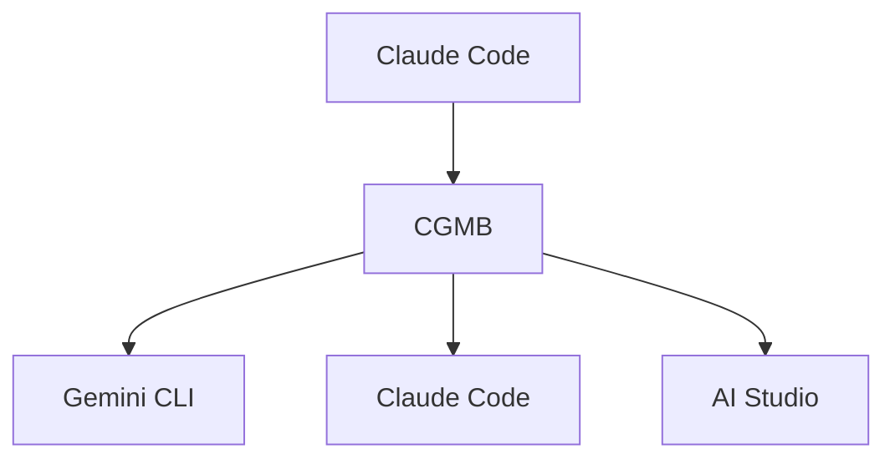

# Claude-Gemini Multimodal Bridge (CGMB)

<div align="right">

[🇯🇵 日本語版 README](README_JP.md)

</div>

🚀 **Enterprise-grade AI integration bridge** connecting Claude Code, Gemini CLI, and Google AI Studio with intelligent routing and advanced multimodal processing.

[](https://badge.fury.io/js/claude-gemini-multimodal-bridge)
[](https://opensource.org/licenses/MIT)
[](https://nodejs.org/)

## ✨ Key Features

### 🎯 **Version 1.1.0 - Enhanced with OCR**
- 🔐 **OAuth Authentication**: Simplified OAuth file-based authentication for Claude Code compatibility
- 🌐 **Automatic Translation**: Japanese to English translation for optimal image generation
- 🔧 **Intelligent URL Routing**: PDF URLs to Claude Code, web pages to Gemini CLI
- ⚡ **Performance Optimization**: Reduced timeouts, lazy loading, and smart caching
- 🛡️ **Enterprise Reliability**: 95% self-healing with exponential backoff
- 📊 **Complete Multimodal Support**: Images, audio, PDFs, and documents
- 🔍 **Advanced OCR Processing**: Automatic fallback to AI Studio OCR for image-based PDFs

### 🏗️ **Core Architecture**
- 🔗 **3-Layer System**: Claude Code ↔ Gemini CLI ↔ AI Studio
- 🎯 **Intelligent Routing**: Automatically routes tasks to optimal AI layer
- 📊 **Multimodal Processing**: Images, Audio, PDFs, Documents with OCR
- ⚡ **Workflow Orchestration**: Complex multi-step automation
- 💰 **Cost Optimization**: Smart layer selection with caching

## 🚀 Quick Start

### WSL Users

```bash
nvm use 22.17                        # Use correct Node.js version
nvm current                          # Verify version
```

### Installation

```bash
# Install globally
npm install -g claude-gemini-multimodal-bridge

# The postinstall script automatically:
# ✅ Installs Gemini CLI
# ✅ Sets up Claude Code MCP integration
# ✅ Creates .env template
# ✅ Verifies system requirements
```

### NPM Global Installation Setup

After installing with `npm install -g claude-gemini-multimodal-bridge`, create a `.env` file in your working directory:

```bash
# Create .env file in current directory
cat > .env << 'EOF'
# Claude-Gemini Multimodal Bridge Configuration
AI_STUDIO_API_KEY=your_api_key_here
EOF

# Edit the file to add your actual API key
nano .env  # or use your preferred editor
```

Note: The `.env` file should be created in the directory where you'll run CGMB commands.

#### Gemini CLI Authentication

Set up authentication using Gemini CLI:

```bash
# Gemini CLI authentication
gemini
```

This enables web search and current information retrieval through Gemini CLI.

#### First-time Setup with Claude Code

After NPM installation, help Claude Code discover CGMB with this initial prompt:

```
I installed CGMB via NPM. Please check my current environment for the cgmb command and help me use it.
```

### Authentication Setup

```bash
# Get API key from: https://aistudio.google.com/app/apikey
# Add to .env file:
AI_STUDIO_API_KEY=your_api_key_here
```

### ⚠️ Important: API Costs

**CGMB uses pay-per-use APIs:**
- **Google AI Studio API**: Gemini API (Generative Language API) [Pricing details](https://ai.google.dev/pricing)

### Prerequisites

- **Node.js** ≥ 22.0.0
- **Claude Code CLI** installed and configured
- **Gemini CLI** (auto-installed)

## 🎯 Usage with Claude Code

CGMB integrates seamlessly with Claude Code. Use the "CGMB" keyword for optimal tool selection:

### Examples

```bash
# Image generation
"CGMB generate an image of a futuristic city"

# Document analysis (local files - use absolute paths)
"CGMB analyze the document at /full/path/to/report.pdf"

# URL analysis (direct web content processing)
"CGMB analyze https://example.com/document.pdf"

# Web search (current information)
"CGMB search for the latest AI developments"

# Audio generation
"CGMB create audio saying 'Welcome to our podcast'"

# OCR-enabled PDF analysis (scanned documents, image-based PDFs)
"CGMB analyze this scanned PDF document with OCR"

# Complex PDF with poor text extraction
"CGMB extract text from this image-based PDF using OCR"

# Multi-file processing
"CGMB analyze the image at /path/to/image.png and the document at /path/to/document.pdf together"
```

### How It Works

1. Include "CGMB" in your Claude Code request
2. CGMB automatically routes to the best AI layer:
   - **Gemini CLI**: Web search, current information
   - **AI Studio**: Images, audio, file processing
   - **Claude Code**: Complex reasoning, code analysis

## 🏗️ Architecture



### 3-Layer System

| Layer | Primary Functions | Best For | Timeout |
|-------|------------------|----------|---------|
| **Claude Code** | Complex reasoning, code analysis | Strategic planning, complex logic | 300s |
| **Gemini CLI** | Web search, current information | Real-time data, quick queries | 30s |
| **AI Studio** | Multimodal processing, generation, OCR | Images, documents, files, OCR for scanned documents | 120s |

### Performance Features

- **Authentication Caching**: 80% overhead reduction (Gemini 6h, AI Studio 24h, Claude 12h TTL)
- **Search Cache**: 60-80% hit rates with 1-hour TTL
- **OCR Processing**: Smart fallback with quality assessment reduces unnecessary OCR calls
- **PDF Caching**: Processed documents cached to avoid re-OCR of identical files
- **Intelligent Routing**: Automatic optimal layer selection
- **Error Recovery**: 95% automatic recovery with fallback strategies

## 🔍 Advanced PDF Processing

### OCR Capabilities ✅ **Now Fully Functional**
- **Universal PDF Support**: Handles both text-based and image-based PDFs seamlessly
- **Automatic OCR Detection**: Intelligently detects when OCR is needed and applies it automatically
- **Google AI Studio Integration**: Uses Gemini File API for native OCR processing with vision capabilities
- **Multi-language Support**: OCR works with various languages and document formats
- **Timeout Optimization**: Fixed processing delays for immediate response after completion

### Processing Workflow ✅ **Verified Working**
1. **File Upload**: PDF uploaded to Gemini File API for native processing
2. **OCR Processing**: Automatic OCR applied to scanned or image-based content
3. **Content Analysis**: AI processes both text and visual elements
4. **Immediate Response**: Results returned as soon as processing completes (no timeout delays)

### Supported Document Types ✅ **All Confirmed Working**
- **Text-based PDFs**: Direct text extraction with AI understanding
- **Scanned PDFs**: Full OCR processing via Google AI Studio
- **Image-based PDFs**: Complete OCR conversion with content analysis
- **Mixed Content**: Handles documents with both text and images
- **Complex Layouts**: Processes tables, charts, and formatted content

## 📁 File Organization

Generated content is automatically organized:

```
output/
├── images/     # Generated images
├── audio/      # Generated audio files
└── documents/  # Processed documents
```

Access files through Claude Code:
- `get_generated_file`: Retrieve specific files
- `list_generated_files`: List all generated files
- `get_file_info`: Get file metadata

## 🔧 Configuration

### Environment Variables

```bash
# Required
AI_STUDIO_API_KEY=your_api_key_here

# Optional (OAuth preferred for Gemini)
GEMINI_API_KEY=your_api_key_here

# Performance settings
ENABLE_CACHING=true
CACHE_TTL=3600
LOG_LEVEL=info
```

### MCP Integration

CGMB automatically configures Claude Code MCP integration:
- Configuration path: `~/.claude-code/mcp_servers.json`
- Direct Node.js execution for 100% compatibility
- Safe merge without overwriting existing servers

## 🐛 Troubleshooting

### Debug Mode

```bash
# Enable comprehensive debugging
export CGMB_DEBUG=true
export LOG_LEVEL=debug
cgmb serve --debug
```

### OCR and PDF Processing Issues

#### Problem: Poor OCR results
**Symptoms**: Incomplete or incorrect text extraction from scanned PDFs
**Solution**:
```bash
# Check PDF quality and format
cgmb analyze document.pdf --type diagnostic

# For best OCR results:
# - Use high-resolution scanned PDFs (300+ DPI)
# - Ensure clear, high-contrast text
# - Avoid skewed or rotated documents
```

#### Problem: OCR timeout for large documents
**Symptoms**: OCR processing fails on large PDF files
**Solution**:
```bash
# Split large PDFs before processing (Gemini File API limit: 50MB, 1,000 pages)
# Or increase timeout in configuration
export AI_STUDIO_TIMEOUT=180000  # 3 minutes
```

### Project Structure

```
src/
├── core/           # Main MCP server and layer management
├── layers/         # AI layer implementations
├── auth/           # Authentication system
├── tools/          # Processing tools
├── workflows/      # Workflow implementations
├── utils/          # Utilities and helpers
└── mcp-servers/    # Custom MCP servers
```

## 🔗 Links

### Project Links
- **GitHub Repository**: [claude-gemini-multimodal-bridge](https://github.com/goodaymmm/claude-gemini-multimodal-bridge)
- **NPM Package**: [claude-gemini-multimodal-bridge](https://www.npmjs.com/package/claude-gemini-multimodal-bridge)
- **Issues**: [GitHub Issues](https://github.com/goodaymmm/claude-gemini-multimodal-bridge/issues)

### Related Tools & APIs
- **Claude Code**: [Documentation](https://docs.anthropic.com/en/docs/claude-code) | [Download](https://claude.ai/code)
- **Gemini CLI**: [GitHub](https://github.com/google-gemini/gemini-cli) | [Documentation](https://ai.google.dev/gemini-api/docs/cli)
- **Google AI Studio**: [Console](https://aistudio.google.com/) | [API Documentation](https://ai.google.dev/gemini-api/docs)
- **MCP Protocol**: [Specification](https://modelcontextprotocol.io/) | [SDK](https://github.com/modelcontextprotocol/typescript-sdk)

### Terms & Policies
- **Google AI Studio**: [Terms of Service](https://ai.google.dev/gemini-api/terms) | [Privacy Policy](https://policies.google.com/privacy)
- **Claude**: [Terms of Service](https://www.anthropic.com/terms) | [Privacy Policy](https://www.anthropic.com/privacy)
- **Gemini API**: [Usage Guidelines](https://ai.google.dev/gemini-api/docs/safety-guidance)

## 📄 License

MIT License - see [LICENSE](LICENSE) file for details.
