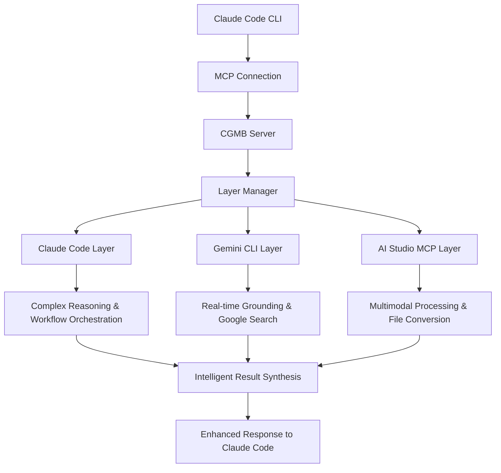

# Claude-Gemini Multimodal Bridge (CGMB)

🚀 **Multi-layer AI integration bridge** connecting Claude Code, Gemini CLI, and Google AI Studio for advanced multimodal processing

[](https://badge.fury.io/js/claude-gemini-multimodal-bridge)
[](https://opensource.org/licenses/MIT)
[](https://nodejs.org/)

## ✨ Features

- 🔗 **3-Layer Architecture**: Claude Code ↔ Gemini CLI ↔ AI Studio
- 🎯 **Adaptive Execution**: Automatically routes tasks to optimal AI layer
- 📊 **Multimodal Processing**: Images, Audio, PDFs, Documents
- ⚡ **Workflow Orchestration**: Complex multi-step automation
- 🛡️ **Robust Error Handling**: Fallback strategies & retry logic
- 🔧 **Extensible Design**: Easy to add new layers and tools
- 💰 **Cost Optimization**: Smart layer selection for efficiency
- 🔄 **Real-time Processing**: Streaming responses and parallel execution

## 🏗️ Architecture

CGMB operates as an **MCP (Model Context Protocol) server** that seamlessly integrates three powerful AI layers. Claude Code connects to CGMB via MCP, enabling transparent enhancement of your existing workflows.



### How It Works

1. **MCP Integration**: CGMB runs as an MCP server that Claude Code can connect to
2. **Transparent Enhancement**: Your existing Claude Code workflows remain unchanged
3. **Intelligent Routing**: CGMB automatically routes tasks to the optimal AI layer
4. **Unified Results**: All responses are synthesized and returned through Claude Code

### Layer Responsibilities

| Layer | Primary Functions | Best For |
|-------|------------------|----------|
| **Claude Code** | Complex reasoning, workflow orchestration, code analysis | Strategic planning, complex logic |
| **Gemini CLI** | Grounding, search, rapid processing | Real-time data, command execution |
| **AI Studio MCP** | Multimodal processing, file conversion | Images, audio, PDFs, documents |

## 🚀 Quick Start

### Installation

**Option 1: Clone and Build (Recommended)**
```bash
# Clone the repository
git clone https://github.com/goodaymmm/claude-gemini-multimodal-bridge.git
cd claude-gemini-multimodal-bridge

# Install dependencies and build
npm install
npm run build

# Make CLI globally available
npm link
```

**Option 2: Direct Usage (No Installation)**
```bash
# Run directly with npx
npx claude-gemini-multimodal-bridge serve

# Or clone and run without global installation
git clone https://github.com/goodaymmm/claude-gemini-multimodal-bridge.git
cd claude-gemini-multimodal-bridge
npm install && npm run build
npm start
```

### Prerequisites

- **Node.js** ≥ 22.0.0 (Recommended: 22.17+)
- **Claude Code CLI** installed and configured
- **Gemini CLI** installed

### Authentication Requirements (Choose One Method Per Service)

#### **Gemini Authentication**
- **Method 1 (Recommended)**: OAuth via `gemini auth` command
- **Method 2 (Alternative)**: Google AI Studio API key

#### **Claude Authentication**  
- **Free Tier**: Uses built-in Claude Code authentication (no additional setup needed)
- **Paid Tier**: Optional API key to bypass rate limits

### Setup

```bash
# Run setup wizard
cgmb setup

# Set up authentication for all services
cgmb auth --interactive

# Verify installation and authentication
cgmb verify

# Add CGMB to Claude Code (one-time setup)
claude mcp add cgmb

# Now use Claude Code normally with enhanced capabilities!
claude "Hello! Test the enhanced capabilities."
```

### Configuration

Copy `.env.example` to `.env` and configure (all settings are optional):

```bash
# Authentication (Optional - OAuth is recommended)
GEMINI_API_KEY=your_api_key_here_optional  # Only if not using OAuth
CLAUDE_API_KEY=your_api_key_here_optional  # Only for paid tier rate limit bypass

# CLI Tool Paths (Auto-detected if in PATH)
CLAUDE_CODE_PATH=/usr/local/bin/claude
GEMINI_CLI_PATH=/usr/local/bin/gemini

# Processing Options
GEMINI_MODEL=gemini-2.5-pro
DEFAULT_LAYER_PRIORITY=adaptive
ENABLE_CACHING=true
```

### Quick Authentication Setup

#### **Gemini (Recommended: OAuth)**
```bash
# Install Gemini CLI (if not installed)
npm install -g @google/gemini-cli

# Authenticate with Google
gemini auth

# Test authentication
gemini "Hello, test authentication"
```

#### **Alternative: API Key Method**
```bash
# Get API key from: https://aistudio.google.com/
# Add to .env file:
echo "GEMINI_API_KEY=your_api_key_here" >> .env
```

## 📖 Usage

### Simple Setup with Claude Code

```bash
# 1. Add CGMB as MCP server (one-time setup)
claude mcp add cgmb

# 2. Use Claude Code normally - CGMB enhances automatically
claude "Analyze this image and describe what you see @image.png"
claude "Summarize this PDF document @document.pdf"
claude "What are the latest developments in AI technology?"
claude "Convert this spreadsheet to markdown format @data.xlsx"
```

### How It Works

When you use Claude Code with CGMB connected:

1. **Automatic Enhancement**: CGMB detects what type of task you're doing
2. **Smart Routing**: Routes to the best AI layer (Claude Code, Gemini CLI, or AI Studio)
3. **Transparent Results**: You get enhanced capabilities without learning new commands

### Enhanced Capabilities

| Input Type | CGMB Enhancement | Example |
|------------|------------------|---------|
| **Images** | Advanced visual analysis | `claude "Analyze this chart @chart.png"` |
| **PDFs** | Full document processing | `claude "Extract tables from @report.pdf"` |
| **Audio** | Transcription + analysis | `claude "Transcribe and summarize @meeting.mp3"` |
| **Current Info** | Real-time search | `claude "Latest news about quantum computing"` |
| **Complex Tasks** | Multi-layer processing | `claude "Compare these 3 documents @doc1.pdf @doc2.pdf @doc3.pdf"` |

### Advanced Workflow Example

```typescript
// Custom workflow definition
const workflow = {
  steps: [
    {
      id: "extract_text",
      layer: "aistudio", 
      action: "convert_pdf_to_text",
      input: { files: "@input.files" }
    },
    {
      id: "analyze_content",
      layer: "claude",
      action: "complex_analysis", 
      input: { 
        text: "@extract_text.output",
        analysis_type: "sentiment_and_themes"
      },
      dependsOn: ["extract_text"]
    },
    {
      id: "generate_summary",
      layer: "gemini",
      action: "create_summary",
      input: {
        analysis: "@analyze_content.output",
        format: "executive_summary"
      },
      dependsOn: ["analyze_content"]
    }
  ]
};
```

### Workflow Types

| Type | Description | Use Cases |
|------|-------------|-----------|
| `analysis` | Multi-layer content analysis | Research, insights, evaluation |
| `conversion` | File format conversion | PDF→Markdown, image processing |
| `extraction` | Data extraction from files | Tables, text, metadata |
| `generation` | Content creation | Reports, summaries, presentations |

## 📊 Quota Monitoring & Management

CGMB includes comprehensive API quota monitoring to help you stay within free tier limits and avoid unexpected charges.

### Free Tier Limits (Google AI Studio)

- **Requests**: 15/minute, 1,500/day
- **Tokens**: 32,000/minute, 50,000/day

### Quota Commands

```bash
# Check current quota usage
cgmb quota-status

# Detailed quota breakdown
cgmb quota-status --detailed
```

### Automatic Quota Management

- **Pre-request Validation**: Checks quota before making API calls
- **Smart Warnings**: Alerts at 80% and 90% usage thresholds  
- **Automatic Blocking**: Prevents requests that would exceed limits
- **Reset Tracking**: Monitors daily and per-minute reset times

### Quota Status Examples

```bash
📊 Google AI Studio API Quota Status
=====================================
Tier: FREE

✅ Requests (Daily): 45/1500 (3%)
   Remaining: 1455
   Reset in: 18h

✅ Tokens (Daily): 12450/50000 (25%)
   Remaining: 37550

✅ Overall Status: HEALTHY
```

## 🛠️ API Reference

### Core Tools

#### `multimodal_process`
Process multimodal content through the 3-layer pipeline.

```json
{
  "prompt": "string",
  "files": [{"path": "string", "type": "image|audio|pdf|document"}],
  "workflow": "analysis|conversion|extraction|generation",
  "options": {
    "layer_priority": "claude|gemini|aistudio|adaptive",
    "execution_mode": "sequential|parallel|adaptive", 
    "quality_level": "fast|balanced|quality"
  }
}
```

#### `document_analysis`
Advanced document analysis combining all layers.

```json
{
  "documents": ["string"],
  "analysis_type": "summary|comparison|extraction|translation",
  "output_requirements": "string"
}
```

#### `workflow_orchestration`
Execute complex multi-step workflows.

```json
{
  "workflow_definition": {
    "steps": [/* WorkflowStep[] */],
    "fallbackStrategies": {/* ... */}
  },
  "input_data": {/* any */},
  "execution_mode": "sequential|parallel|adaptive"
}
```

## 📊 Performance & Optimization

### Adaptive Layer Selection

CGMB automatically selects the optimal layer based on:

- **Task complexity**: Simple → Gemini, Complex → Claude
- **Content type**: Multimodal → AI Studio, Text → Gemini
- **Real-time needs**: Urgent → Gemini CLI, Quality → Claude
- **Cost considerations**: Budget-conscious routing

### Caching Strategy

```bash
# Enable intelligent caching
ENABLE_CACHING=true
CACHE_TTL=3600  # 1 hour

# Cache hit rates typically 40-60% for repeated operations
```

### Cost Optimization

- **Free Tier Usage**: Maximizes free quotas across all services
- **Smart Routing**: Routes simple tasks to free/cheaper layers
- **Batch Processing**: Combines multiple operations when possible

## 🔧 Advanced Configuration

### Layer-Specific Settings

```bash
# Claude Code Layer
CLAUDE_CODE_TIMEOUT=300000
CLAUDE_ENABLE_DANGEROUS_MODE=false

# Gemini CLI Layer  
GEMINI_MODEL=gemini-2.5-pro
GEMINI_TIMEOUT=60000
GEMINI_USE_SEARCH=true

# AI Studio Layer
AISTUDIO_MAX_FILES=10
AISTUDIO_MAX_FILE_SIZE=100
AISTUDIO_ENABLE_VISION=true
```

### Custom Workflows

```typescript
import { LayerManager, ExecutionPlan } from 'claude-gemini-multimodal-bridge';

const customWorkflow: ExecutionPlan = {
  steps: [
    // Your custom workflow steps
  ],
  fallbackStrategies: {
    // Fallback configurations
  }
};

const layerManager = new LayerManager(config);
const result = await layerManager.executeWorkflow(customWorkflow, inputData, options);
```

## 🧪 Testing

```bash
# Run all tests
npm test

# Run specific test suites
npm run test:unit
npm run test:integration  
npm run test:e2e

# Test with real APIs
cgmb test --file example.pdf --prompt "Analyze this document"
```

## 🐛 Troubleshooting

### Common Issues

**"Layer not available" errors:**
```bash
# Check layer status and authentication
cgmb verify

# Check authentication status
cgmb auth-status

# Test individual layers
claude --version
gemini --help
```

**API key issues:**
```bash
# Check authentication status
cgmb auth-status --verbose

# Test Gemini API directly
gemini "test prompt"

# Verify environment variables
cgmb detect-paths
```

**Quota exceeded errors:**
```bash
# Check current quota usage
cgmb quota-status

# Wait for quota reset or upgrade plan
# Free tier resets daily
```

**Path detection issues:**
```bash
# Auto-detect CLI tool paths
cgmb detect-paths

# Fix common PATH issues
cgmb detect-paths --fix

# Manual PATH setup
export GEMINI_CLI_PATH=/usr/local/bin/gemini
export CLAUDE_CODE_PATH=/usr/local/bin/claude
```

**Performance issues:**
```bash
# Enable debug logging
LOG_LEVEL=debug cgmb serve

# Check resource usage
htop  # Monitor CPU/memory during processing

# Monitor quota usage
cgmb quota-status --detailed
```

### Debug Mode

```bash
# Enable comprehensive debugging
DEBUG=true LOG_LEVEL=debug cgmb serve --debug
```

## 🤝 Contributing

We welcome contributions! See [CONTRIBUTING.md](docs/CONTRIBUTING.md) for guidelines.

### Development Setup

```bash
git clone https://github.com/yourusername/claude-gemini-multimodal-bridge
cd claude-gemini-multimodal-bridge
npm install
npm run dev
```

### Adding New Layers

```typescript
import { LayerInterface, LayerResult } from './types';

export class MyCustomLayer implements LayerInterface {
  async initialize(): Promise<void> { /* ... */ }
  async execute(task: any): Promise<LayerResult> { /* ... */ }
  // Implement other required methods
}
```

## 📄 License

MIT License - see [LICENSE](LICENSE) file for details.

## 🙏 Acknowledgments

- **Anthropic** for Claude and MCP protocol
- **Google** for Gemini models and AI Studio
- **Community contributors** for feedback and improvements

## 📞 Support

- **Issues**: [GitHub Issues](https://github.com/yourusername/claude-gemini-multimodal-bridge/issues)
- **Discussions**: [GitHub Discussions](https://github.com/yourusername/claude-gemini-multimodal-bridge/discussions)
- **Documentation**: [docs/](docs/)

---

**Built with ❤️ for the AI development community**