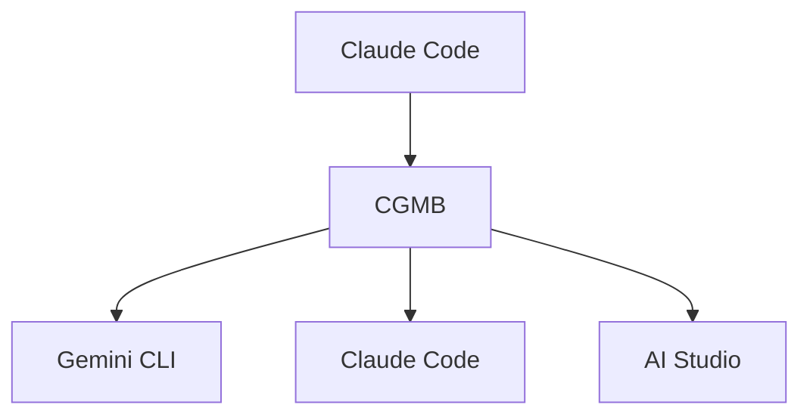

# Claude-Gemini Multimodal Bridge (CGMB)

<div align="right">

[🇺🇸 English README](README.md)

</div>

Claude Code、Gemini CLI、Google AI Studioを統合するMCPブリッジです。

[](https://badge.fury.io/js/claude-gemini-multimodal-bridge)
[](https://opensource.org/licenses/MIT)
[](https://nodejs.org/)

## 主な機能

### v1.1.0の変更点
- Windows環境でのCLI/MCP両方に対応
- MCP統合の非同期レイヤー初期化を改善
- Gemini最新モデル対応: `gemini-2.5-flash`, `gemini-2.5-pro`, `gemini-3-flash`
- OAuth認証: Claude Code互換のファイルベース認証
- 自動翻訳: 画像生成時の日本語→英語翻訳
- URLルーティング: PDF URLはClaude Codeへ、WebページはGemini CLIへ
- パフォーマンス最適化: タイムアウト短縮、遅延読み込み、キャッシング
- エラー回復: 指数バックオフによる95%の自己修復
- マルチモーダルサポート: 画像、音声、PDF、ドキュメント
- OCR処理: 画像ベースPDFに対するAI Studio OCRへの自動フォールバック

### 3層アーキテクチャ
- Claude Code ↔ Gemini CLI ↔ AI Studio
- タスクを最適なAIレイヤーに自動ルーティング
- 画像、音声、PDF、OCR対応ドキュメント処理
- ワークフローオーケストレーション
- キャッシングによるコスト最適化

## クイックスタート

### 前提条件

- Node.js ≥ 22.0.0
- Claude Code CLI インストール済み
- Gemini CLI (自動インストール)

### インストール

```bash
npm install -g claude-gemini-multimodal-bridge
```

postinstallスクリプトが以下を自動実行:
- Gemini CLIインストール
- Claude Code MCP統合セットアップ
- .envテンプレート作成
- システム要件検証

### 環境設定

作業ディレクトリに`.env`ファイルを作成:

```bash
AI_STUDIO_API_KEY=your_api_key_here
```

APIキーは https://aistudio.google.com/app/apikey から取得できます。

### Gemini CLI認証

```bash
gemini
```

### Claude Codeでの初回セットアップ

NPMインストール後、以下のプロンプトでCGMBを認識させてください:

```
NPMでCGMBをインストールしたので、今の環境からcgmbコマンドを探してください。使い方も教えてください。
```

## APIコスト

CGMBは従量課金制APIを使用します:
- Google AI Studio API: [料金詳細](https://ai.google.dev/pricing)

## 使用方法

CGMBはClaude Codeとシームレスに統合されます。「CGMB」キーワードを使用してください:

```bash
# 画像生成
"CGMBで未来都市のイメージを生成してください"

# ドキュメント分析（絶対パスを使用）
"CGMBで/full/path/to/report.pdfにあるこの文書を分析してください"

# URL分析
"CGMBでhttps://example.com/document.pdfを分析してください"

# Web検索
"CGMBで最新のAI情報を検索してください"

# 音声生成
"CGMBで「ポッドキャストへようこそ」という音声を作成してください"

# OCR対応PDF解析
"CGMBでこのスキャンされたPDF文書をOCRで解析してください"
```

### ルーティング

1. Claude Codeリクエストに「CGMB」を含める
2. CGMBが最適なAIレイヤーに自動ルーティング:
   - Gemini CLI: Web検索、最新情報
   - AI Studio: 画像、音声、ファイル処理
   - Claude Code: 複雑な推論、コード分析

## アーキテクチャ



| レイヤー | 主要機能 | タイムアウト |
|---------|---------|------------|
| Claude Code | 複雑な推論、コード分析 | 300秒 |
| Gemini CLI | Web検索、最新情報 | 30秒 |
| AI Studio | マルチモーダル処理、生成、OCR | 120秒 |

### パフォーマンス

- 認証キャッシング: 80%のオーバーヘッド削減
- 検索キャッシュ: 60-80%のヒット率、1時間TTL
- OCR処理: 品質評価によるスマートフォールバック
- エラー回復: フォールバック戦略による95%の自動回復

## PDF処理

### OCR機能
- テキストベースと画像ベースの両方のPDFを処理
- OCRが必要な場合を自動検出
- Google AI Studio統合: Gemini File APIでネイティブOCR処理
- 多言語サポート

### 処理ワークフロー
1. ファイルアップロード: PDFをGemini File APIにアップロード
2. OCR処理: スキャンコンテンツに自動OCRを適用
3. コンテンツ分析: テキストと視覚要素の両方を処理
4. 即座レスポンス: 処理完了と同時に結果を返却

### サポート形式
- テキストベースPDF
- スキャンPDF（OCR処理）
- 画像ベースPDF（OCR変換）
- 混合コンテンツ
- 複雑なレイアウト（表、グラフ、フォーマット済みコンテンツ）

## ファイル構成

生成されたコンテンツは自動的に整理されます:

```
output/
├── images/     # 生成された画像
├── audio/      # 生成された音声ファイル
└── documents/  # 処理されたドキュメント
```

Claude Code経由でファイルにアクセス:
- `get_generated_file`: 特定のファイルを取得
- `list_generated_files`: すべての生成ファイルをリスト
- `get_file_info`: ファイルメタデータを取得

## 設定

### 環境変数

```bash
# 必須
AI_STUDIO_API_KEY=your_api_key_here

# オプション
GEMINI_API_KEY=your_api_key_here
ENABLE_CACHING=true
CACHE_TTL=3600
LOG_LEVEL=info
```

### MCP統合

CGMBは自動的にClaude Code MCP統合を設定:
- 設定パス: `~/.claude-code/mcp_servers.json`
- 直接Node.js実行
- 既存サーバーを上書きしない安全なマージ

## Windows環境

CGMBはv1.1.0でWindows環境を完全サポート:

- CLI: すべてのコマンドが動作
- MCP統合: MCPツール呼び出しが正常動作
- パス解決: Windows形式のパス（`C:\path\to\file`）を自動処理
- Gemini CLI: Windows版との完全な互換性

```bash
# パスは絶対パスを推奨
cgmb analyze "C:\Users\name\Documents\report.pdf"

# 環境変数の設定（PowerShell）
$env:AI_STUDIO_API_KEY = "your_api_key_here"

# 環境変数の設定（コマンドプロンプト）
set AI_STUDIO_API_KEY=your_api_key_here
```

## トラブルシューティング

### デバッグモード

```bash
export CGMB_DEBUG=true
export LOG_LEVEL=debug
cgmb serve --debug
```

### OCRとPDF処理の問題

OCR結果が不正確な場合:
- 高解像度スキャンPDF（300+ DPI）を使用
- 明瞭で高コントラストなテキストを確保
- 傾きや回転した文書を避ける

大きな文書でOCRタイムアウトする場合:
- 処理前に大きなPDFを分割（Gemini File API制限: 50MB、1,000ページ）
- タイムアウトを延長: `export AI_STUDIO_TIMEOUT=180000`

## プロジェクト構造

```
src/
├── core/           # メインMCPサーバーとレイヤー管理
├── layers/         # AIレイヤー実装
├── auth/           # 認証システム
├── tools/          # 処理ツール
├── workflows/      # ワークフロー実装
├── utils/          # ユーティリティとヘルパー
└── mcp-servers/    # カスタムMCPサーバー
```

## リンク

### プロジェクト
- [GitHub](https://github.com/goodaymmm/claude-gemini-multimodal-bridge)
- [NPM](https://www.npmjs.com/package/claude-gemini-multimodal-bridge)
- [Issues](https://github.com/goodaymmm/claude-gemini-multimodal-bridge/issues)

### 関連ツール
- [Claude Code](https://docs.anthropic.com/en/docs/claude-code)
- [Gemini CLI](https://github.com/google-gemini/gemini-cli)
- [Google AI Studio](https://aistudio.google.com/)
- [MCP](https://modelcontextprotocol.io/)

### 利用規約
- [Google AI Studio](https://ai.google.dev/gemini-api/terms)
- [Claude](https://www.anthropic.com/terms)
- [Gemini API](https://ai.google.dev/gemini-api/docs/safety-guidance)

## ライセンス

MIT - [LICENSE](LICENSE)を参照
