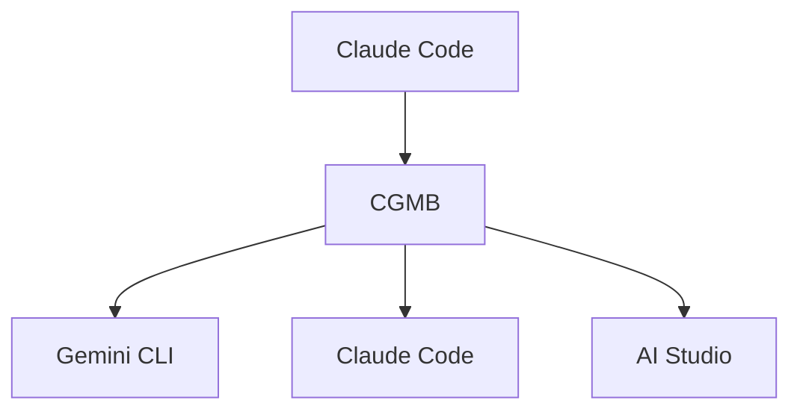

# Claude-Gemini Multimodal Bridge (CGMB)

<div align="right">

[🇺🇸 English README](README.md)

</div>

🚀 **エンタープライズグレードのAI統合ブリッジ** - Claude Code、Gemini CLI、Google AI Studioをインテリジェントなルーティングと高度なマルチモーダル処理で接続します。

[](https://badge.fury.io/js/claude-gemini-multimodal-bridge)
[](https://opensource.org/licenses/MIT)
[](https://nodejs.org/)

## ✨ 主な機能

### 🎯 **バージョン 1.0.0 - プロダクションレディ**
- 🔐 **OAuth認証**: Claude Code互換性のための簡素化されたOAuthファイルベース認証
- 🌐 **自動翻訳**: 最適な画像生成のための日本語から英語への翻訳
- 🔧 **インテリジェントURLルーティング**: PDF URLはClaude Codeへ、WebページはGemini CLIへ
- ⚡ **パフォーマンス最適化**: タイムアウト短縮、遅延読み込み、スマートキャッシング
- 🛡️ **エンタープライズ信頼性**: 指数バックオフによる95%の自己修復
- 📊 **完全なマルチモーダルサポート**: 画像、音声、PDF、ドキュメント

### 🏗️ **コアアーキテクチャ**
- 🔗 **3層システム**: Claude Code ↔ Gemini CLI ↔ AI Studio
- 🎯 **インテリジェントルーティング**: タスクを最適なAIレイヤーに自動ルーティング
- 📊 **マルチモーダル処理**: 画像、音声、PDF、ドキュメント
- ⚡ **ワークフローオーケストレーション**: 複雑な多段階自動化
- 💰 **コスト最適化**: キャッシングを使用したスマートレイヤー選択

## 🚀 クイックスタート

### WSLユーザー向け

```bash
nvm use 22.17                        # 正しいNode.jsバージョンを使用
nvm current                          # バージョンを確認
```

### インストール

```bash
# グローバルインストール
npm install -g claude-gemini-multimodal-bridge

# postinstallスクリプトが自動的に実行:
# ✅ Gemini CLIをインストール
# ✅ Claude Code MCP統合をセットアップ
# ✅ .envテンプレートを作成
# ✅ システム要件を検証
```

### NPMグローバルインストール後の設定

`npm install -g claude-gemini-multimodal-bridge`でインストール後、作業ディレクトリに`.env`ファイルを作成してください：

```bash
# 現在のディレクトリに.envファイルを作成
cat > .env << 'EOF'
# Claude-Gemini Multimodal Bridge Configuration
AI_STUDIO_API_KEY=your_api_key_here
EOF

# 実際のAPIキーを追加するためにファイルを編集
nano .env  # またはお好みのエディタを使用
```

注意：`.env`ファイルはCGMBコマンドを実行するディレクトリに作成してください。

#### Gemini CLIの認証

Gemini CLIを使用して認証を設定してください：

```bash
# Gemini CLIの認証
gemini
```

Gemini CLIを通じてWeb検索や最新情報の取得が可能になります。

#### Claude Codeでの初回セットアップ

NPMインストール後、Claude Codeに以下の初回プロンプトでCGMBを認識させてください：

```
NPMでCGMBをインストールしたので、今の環境からcgmbコマンドを探してください。使い方も教えてください。
```

Claude Codeは以下を実行します：
1. PATHから`cgmb`コマンドを検出
2. `cgmb --help`で利用可能なコマンドを表示
3. `cgmb chat`などの機能の使い方を説明

検出後の使用例：
```bash
cgmb chat "今日のニュースを検索して"
cgmb generate-image "美しい夕日"
```

### 認証セットアップ

```bash
# APIキーを取得: https://aistudio.google.com/app/apikey
# .envファイルに追加:
AI_STUDIO_API_KEY=your_api_key_here
```

### ⚠️ 重要: APIコスト

**CGMBは従量課金制APIを使用します:**
- **Google AI Studio API**: Gemini API (Generative Language API) [料金詳細](https://ai.google.dev/pricing)

### 前提条件

- **Node.js** ≥ 22.0.0
- **Claude Code CLI** インストール済みで設定済み
- **Gemini CLI** (自動インストール)

## 🎯 Claude Codeでの使用

CGMBはClaude Codeとシームレスに統合されます。最適なツール選択のために「CGMB」キーワードを使用してください:

### 使用例

```bash
# 画像生成
"CGMBで未来都市のイメージを生成してください"

# ドキュメント分析（ローカルファイル - 絶対パスを使用）
"CGMBで/full/path/to/report.pdfにあるこの文書を分析してください"

# URL分析（直接Webコンテンツ処理）
"CGMBでhttps://example.com/document.pdfを分析してください"

# Web検索（最新情報）
"CGMBで最新のAI情報を検索してください"

# 音声生成
"CGMBで「ポッドキャストへようこそ」という音声を作成してください。"

# 複数ファイル処理
"CGMBで/path/to/image.pngにある画像と/path/to/document.pdfにある文書を一緒に解析して。"
```

### 動作の仕組み

1. Claude Codeリクエストに「CGMB」を含める
2. CGMBが最適なAIレイヤーに自動ルーティング:
   - **Gemini CLI**: Web検索、最新情報
   - **AI Studio**: 画像、音声、ファイル処理
   - **Claude Code**: 複雑な推論、コード分析


## 🏗️ アーキテクチャ



### 3層システム

| レイヤー | 主要機能 | 最適な用途 | タイムアウト |
|-------|------------------|----------|---------|
| **Claude Code** | 複雑な推論、コード分析 | 戦略的計画、複雑なロジック | 300秒 |
| **Gemini CLI** | Web検索、最新情報 | リアルタイムデータ、クイッククエリ | 30秒 |
| **AI Studio** | マルチモーダル処理、生成 | 画像、ドキュメント、ファイル | 120秒 |

### パフォーマンス機能

- **認証キャッシング**: 80%のオーバーヘッド削減（Gemini 6時間、AI Studio 24時間、Claude 12時間TTL）
- **検索キャッシュ**: 60-80%のヒット率、1時間TTL
- **インテリジェントルーティング**: 最適なレイヤーの自動選択
- **エラー回復**: フォールバック戦略による95%の自動回復

## 📁 ファイル構成

生成されたコンテンツは自動的に整理されます：

```
output/
├── images/     # 生成された画像
├── audio/      # 生成された音声ファイル
└── documents/  # 処理されたドキュメント
```

Claude Code経由でファイルにアクセス：
- `get_generated_file`: 特定のファイルを取得
- `list_generated_files`: すべての生成ファイルをリスト
- `get_file_info`: ファイルメタデータを取得

## 🔧 設定

### 環境変数

```bash
# 必須
AI_STUDIO_API_KEY=your_api_key_here

# オプション（GeminiではOAuth推奨）
GEMINI_API_KEY=your_api_key_here

# パフォーマンス設定
ENABLE_CACHING=true
CACHE_TTL=3600
LOG_LEVEL=info
```

### MCP統合

CGMBは自動的にClaude Code MCP統合を設定：
- 設定パス: `~/.claude-code/mcp_servers.json`
- 100%互換性のための直接Node.js実行
- 既存サーバーを上書きしない安全なマージ

## 🐛 トラブルシューティング

### デバッグモード

```bash
# 包括的なデバッグを有効化
export CGMB_DEBUG=true
export LOG_LEVEL=debug
cgmb serve --debug
```

### プロジェクト構造

```
src/
├── core/           # メインMCPサーバーとレイヤー管理
├── layers/         # AIレイヤー実装
├── auth/           # 認証システム
├── tools/          # 処理ツール
├── workflows/      # ワークフロー実装
├── utils/          # ユーティリティとヘルパー
└── mcp-servers/    # カスタムMCPサーバー
```

## 🔗 リンク

### プロジェクトリンク
- **GitHubリポジトリ**: [claude-gemini-multimodal-bridge](https://github.com/goodaymmm/claude-gemini-multimodal-bridge)
- **NPMパッケージ**: [claude-gemini-multimodal-bridge](https://www.npmjs.com/package/claude-gemini-multimodal-bridge)
- **Issues**: [GitHub Issues](https://github.com/goodaymmm/claude-gemini-multimodal-bridge/issues)

### 関連ツール & API
- **Claude Code**: [ドキュメント](https://docs.anthropic.com/en/docs/claude-code) | [ダウンロード](https://claude.ai/code)
- **Gemini CLI**: [GitHub](https://github.com/google-gemini/gemini-cli) | [ドキュメント](https://ai.google.dev/gemini-api/docs/cli)
- **Google AI Studio**: [コンソール](https://aistudio.google.com/) | [APIドキュメント](https://ai.google.dev/gemini-api/docs)
- **MCPプロトコル**: [仕様](https://modelcontextprotocol.io/) | [SDK](https://github.com/modelcontextprotocol/typescript-sdk)

### 利用規約 & ポリシー
- **Google AI Studio**: [利用規約](https://ai.google.dev/gemini-api/terms) | [プライバシーポリシー](https://policies.google.com/privacy)
- **Claude**: [利用規約](https://www.anthropic.com/terms) | [プライバシーポリシー](https://www.anthropic.com/privacy)
- **Gemini API**: [使用ガイドライン](https://ai.google.dev/gemini-api/docs/safety-guidance)

## 📄 ライセンス

MITライセンス - 詳細は[LICENSE](LICENSE)ファイルを参照してください。