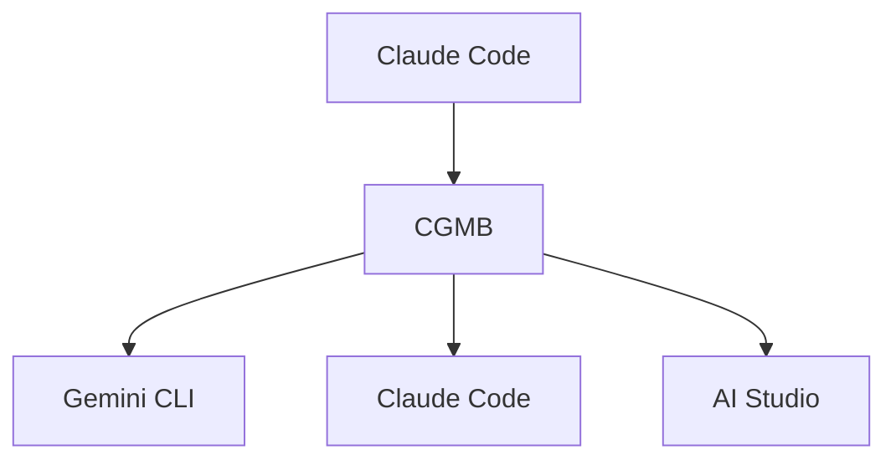

# Claude-Gemini Multimodal Bridge (CGMB)

<div align="right">

[🇺🇸 English README](README.md)

</div>

🚀 **エンタープライズグレードのAI統合ブリッジ** - Claude Code、Gemini CLI、Google AI Studioをインテリジェントなルーティングと高度なマルチモーダル処理で接続します。

[](https://badge.fury.io/js/claude-gemini-multimodal-bridge)
[](https://opensource.org/licenses/MIT)
[](https://nodejs.org/)

## ✨ 主な機能

### 🎯 **バージョン 1.0.0 - プロダクションレディ**
- 🔐 **OAuth認証**: Claude Code互換性のための簡素化されたOAuthファイルベース認証
- 🌐 **自動翻訳**: 最適な画像生成のための日本語から英語への翻訳
- 🔧 **インテリジェントURLルーティング**: PDF URLはClaude Codeへ、WebページはGemini CLIへ
- ⚡ **パフォーマンス最適化**: タイムアウト短縮、遅延読み込み、スマートキャッシング
- 🛡️ **エンタープライズ信頼性**: 指数バックオフによる95%の自己修復
- 📊 **完全なマルチモーダルサポート**: 画像、音声、PDF、ドキュメント

### 🏗️ **コアアーキテクチャ**
- 🔗 **3層システム**: Claude Code ↔ Gemini CLI ↔ AI Studio
- 🎯 **インテリジェントルーティング**: タスクを最適なAIレイヤーに自動ルーティング
- 📊 **マルチモーダル処理**: 画像、音声、PDF、ドキュメント
- ⚡ **ワークフローオーケストレーション**: 複雑な多段階自動化
- 💰 **コスト最適化**: キャッシングを使用したスマートレイヤー選択

## 🚀 クイックスタート

### WSLユーザー向け

```bash
nvm use 22.17                        # 正しいNode.jsバージョンを使用
nvm current                          # バージョンを確認
```

### インストール

```bash
# グローバルインストール
npm install -g claude-gemini-multimodal-bridge

# postinstallスクリプトが自動的に実行:
# ✅ Gemini CLIをインストール
# ✅ Claude Code MCP統合をセットアップ
# ✅ .envテンプレートを作成
# ✅ システム要件を検証
```

### 認証セットアップ

```bash
# APIキーを取得: https://aistudio.google.com/app/apikey
# .envファイルに追加:
AI_STUDIO_API_KEY=your_api_key_here

# サービスの認証
gemini auth              # Gemini用OAuth（推奨）
claude auth              # Claude認証

# インタラクティブセットアップウィザード
cgmb auth --interactive

# インストール確認
cgmb verify
```

### ⚠️ 重要: APIコスト

**CGMBは従量課金制APIを使用します:**
- **Google AI Studio API**: 無料枠あり（15リクエスト/分、1,500/日）。[料金詳細](https://ai.google.dev/pricing)
- **Claude API**: Claude Code経由のサブスクリプションベース使用
- **使用量監視**: `cgmb quota-status`でAPI消費を確認
- **コスト最適化**: CGMBは最もコスト効率の良いレイヤーを自動選択

### 前提条件

- **Node.js** ≥ 22.0.0
- **Claude Code CLI** インストール済みで設定済み
- **Gemini CLI** (自動インストール)

## 🎯 Claude Codeでの使用

CGMBはClaude Codeとシームレスに統合されます。最適なツール選択のために「CGMB」キーワードを使用してください:

### 使用例

```bash
# 画像生成
"CGMB generate an image of a futuristic city"

# ドキュメント分析（ローカルファイル - 絶対パスを使用）
"CGMB analyze this document at /full/path/to/report.pdf"

# URL分析（直接Webコンテンツ処理）
"CGMB analyze the PDF at https://example.com/document.pdf"

# Web検索（最新情報）
"CGMB search for latest AI developments"

# 音声生成
"CGMB create audio saying 'Welcome to our podcast'"

# 複数ファイル処理
"CGMB process the image at /path/to/image.png and document at /path/to/document.pdf together"
```

### 動作の仕組み

1. Claude Codeリクエストに「CGMB」を含める
2. CGMBが最適なAIレイヤーに自動ルーティング:
   - **Gemini CLI**: Web検索、最新情報
   - **AI Studio**: 画像、音声、ファイル処理
   - **Claude Code**: 複雑な推論、コード分析

## 🖥️ CLIコマンド

### コアコマンド

```bash
# MCPサーバー起動（テスト用）
cgmb serve

# ユーザーフレンドリーなチャットインターフェース
cgmb chat "最新のAIトレンドは何ですか？"
cgmb c "簡単な質問"              # 短縮エイリアス

# 直接AIレイヤーアクセス
cgmb gemini "検索クエリ"           # 自動検出、-p不要
cgmb aistudio -f document.pdf -p "これを分析"

# システム検証
cgmb verify                          # インストールチェック
cgmb auth-status                     # 認証チェック
cgmb quota-status                    # API使用量チェック
```

### コンテンツ生成

```bash
# コンテンツポリシー安全性を備えた画像生成
cgmb generate-image "プロフェッショナルなロボットアシスタント"
cgmb generate-image "風景" --output scene.png

# TTSによる音声生成
cgmb generate-audio "ウェルカムメッセージ" --voice Puck
cgmb generate-audio "アナウンス" --output audio.wav

# ドキュメント分析
cgmb analyze document.pdf --type summary
cgmb analyze doc1.pdf doc2.pdf --type compare

# マルチモーダル処理
cgmb multimodal image.png doc.pdf --prompt "レポート作成"
```

## 🏗️ アーキテクチャ



### 3層システム

| レイヤー | 主要機能 | 最適な用途 | タイムアウト |
|-------|------------------|----------|---------|
| **Claude Code** | 複雑な推論、コード分析 | 戦略的計画、複雑なロジック | 300秒 |
| **Gemini CLI** | Web検索、最新情報 | リアルタイムデータ、クイッククエリ | 30秒 |
| **AI Studio** | マルチモーダル処理、生成 | 画像、ドキュメント、ファイル | 120秒 |

### パフォーマンス機能

- **認証キャッシング**: 80%のオーバーヘッド削減（Gemini 6時間、AI Studio 24時間、Claude 12時間TTL）
- **検索キャッシュ**: 60-80%のヒット率、1時間TTL
- **インテリジェントルーティング**: 最適なレイヤーの自動選択
- **エラー回復**: フォールバック戦略による95%の自動回復

## 📁 ファイル構成

生成されたコンテンツは自動的に整理されます：

```
output/
├── images/     # 生成された画像
├── audio/      # 生成された音声ファイル
└── documents/  # 処理されたドキュメント
```

Claude Code経由でファイルにアクセス：
- `get_generated_file`: 特定のファイルを取得
- `list_generated_files`: すべての生成ファイルをリスト
- `get_file_info`: ファイルメタデータを取得

## 🔧 設定

### 環境変数

```bash
# 必須
AI_STUDIO_API_KEY=your_api_key_here

# オプション（GeminiではOAuth推奨）
GEMINI_API_KEY=your_api_key_here

# パフォーマンス設定
ENABLE_CACHING=true
CACHE_TTL=3600
LOG_LEVEL=info
```

### MCP統合

CGMBは自動的にClaude Code MCP統合を設定：
- 設定パス: `~/.claude-code/mcp_servers.json`
- 100%互換性のための直接Node.js実行
- 既存サーバーを上書きしない安全なマージ

## 🔍 重要な実装詳細

### 画像生成
- `gemini-2.0-flash-preview-image-generation`モデルを使用
- 自動プロンプトサニタイゼーション（cute → friendly-looking）
- 安全プレフィックスが自動追加
- ファイルは`output/images/`に保存

### 音声生成
- `gemini-2.5-flash-preview-tts`モデルを使用
- 複数の音声オプション（Kore、Puck）
- 高品質LINEAR16 24kHz出力

### PDF処理修正
- 必要時のみ動的pdf-parse読み込み
- 音声生成干渉を防止
- 完全なPDF分析機能を維持

### Web検索優先度
- Gemini CLIがWeb検索タスクで最高優先度
- キーワードに基づく自動検出：weather、news、stock、today、latest、current
- 組み込みグラウンディング機能

## 🐛 トラブルシューティング

### よくある問題

**認証問題:**
```bash
cgmb auth-status --verbose           # 詳細ステータスを確認
cgmb auth --interactive              # セットアップウィザードを実行
```

**パス検出問題:**
```bash
cgmb detect-paths                    # CLIツールを自動検出
cgmb verify --fix                    # 一般的な問題を自動修正
```

**パフォーマンス問題:**
```bash
export CGMB_DEBUG=true               # デバッグモードを有効化
cgmb quota-status --detailed         # API使用量を確認
```

**Claude Code統合問題:**

*問題: URLが直接処理されずにダウンロードされる*
```bash
# ✅ 解決策: CGMBキーワードを使用し、直接URL処理を指定
"CGMB analyze the content at https://example.com/doc.pdf"
# ❌ 避ける: CGMB分析前のURLの事前ダウンロード
```

*問題: 相対パスが認識されない*  
```bash
# ✅ 解決策: 絶対パスに変換するか、CGMBパス解決を使用
"CGMB analyze /full/absolute/path/to/document.pdf"
# 現在のディレクトリを確認し、相対パスを変換:
pwd  # 現在の作業ディレクトリを取得
# 次に使用: /current/directory/relative/path/file.pdf
```

*問題: CGMBツールが選択されない*
```bash
# ✅ 解決策: 「CGMB」キーワードを明示的に含める
"CGMB process this file"              # ✅ CGMBをトリガー
"Process this file"                   # ❌ CGMBをトリガーしない可能性
```

*問題: ファイル処理エラー*
```bash
# ファイルの権限と存在を確認
ls -la /path/to/file                  # ファイルの存在と権限を確認
file /path/to/file                    # ファイルタイプを確認
cgmb analyze --debug /path/to/file    # 詳細エラー情報用デバッグモード
```

### デバッグモード

```bash
# 包括的なデバッグを有効化
export CGMB_DEBUG=true
export LOG_LEVEL=debug
cgmb serve --debug
```

## 📊 パフォーマンスモニタリング

### クォータ管理

```bash
# 現在の使用量を確認
cgmb quota-status

# 詳細な内訳
cgmb quota-status --detailed
```

### 無料枠制限（Google AI Studio）
- **リクエスト**: 15/分、1,500/日
- **トークン**: 32,000/分、50,000/日

⚠️ **使用量モニタリング**: 無料枠制限を超えるとAPI料金が発生します。予期しないコストを避けるため、常に`cgmb quota-status --detailed`で使用量を監視してください。

## 🤝 貢献

### 開発セットアップ

```bash
git clone https://github.com/goodaymmm/claude-gemini-multimodal-bridge.git
cd claude-gemini-multimodal-bridge
npm install
npm run build
npm run dev
```

**注**: マージ競合を防ぐため、`package-lock.json`は除外されています。各環境は独自のロックファイルを生成します。

### プロジェクト構造

```
src/
├── core/           # メインMCPサーバーとレイヤー管理
├── layers/         # AIレイヤー実装
├── auth/           # 認証システム
├── tools/          # 処理ツール
├── workflows/      # ワークフロー実装
├── utils/          # ユーティリティとヘルパー
└── mcp-servers/    # カスタムMCPサーバー
```

## 📄 ドキュメント

- **[拡張CLIガイド](docs/ENHANCED_CLI_GUIDE.md)**: 包括的なコマンドリファレンス
- **[プロジェクトファイル](PROJECT_FILES.md)**: 完全なファイル構造の概要
- **[Claude Codeガイドライン](CLAUDE.md)**: Claude Code用の統合ガイドライン

## 🔗 リンク

### プロジェクトリンク
- **GitHubリポジトリ**: [claude-gemini-multimodal-bridge](https://github.com/goodaymmm/claude-gemini-multimodal-bridge)
- **NPMパッケージ**: [claude-gemini-multimodal-bridge](https://www.npmjs.com/package/claude-gemini-multimodal-bridge)
- **Issues**: [GitHub Issues](https://github.com/goodaymmm/claude-gemini-multimodal-bridge/issues)

### 関連ツール & API
- **Claude Code**: [ドキュメント](https://docs.anthropic.com/en/docs/claude-code) | [ダウンロード](https://claude.ai/code)
- **Gemini CLI**: [GitHub](https://github.com/google-gemini/gemini-cli) | [ドキュメント](https://ai.google.dev/gemini-api/docs/cli)
- **Google AI Studio**: [コンソール](https://aistudio.google.com/) | [APIドキュメント](https://ai.google.dev/gemini-api/docs)
- **MCPプロトコル**: [仕様](https://modelcontextprotocol.io/) | [SDK](https://github.com/modelcontextprotocol/typescript-sdk)

### 利用規約 & ポリシー
- **Google AI Studio**: [利用規約](https://ai.google.dev/gemini-api/terms) | [プライバシーポリシー](https://policies.google.com/privacy)
- **Claude**: [利用規約](https://www.anthropic.com/terms) | [プライバシーポリシー](https://www.anthropic.com/privacy)
- **Gemini API**: [使用ガイドライン](https://ai.google.dev/gemini-api/docs/safety-guidance)

## 📄 ライセンス

MITライセンス - 詳細は[LICENSE](LICENSE)ファイルを参照してください。

## 🙏 謝辞

- **Anthropic** - ClaudeとMCPプロトコル
- **Google** - GeminiモデルとAI Studio
- **コミュニティ貢献者** - フィードバックと改善