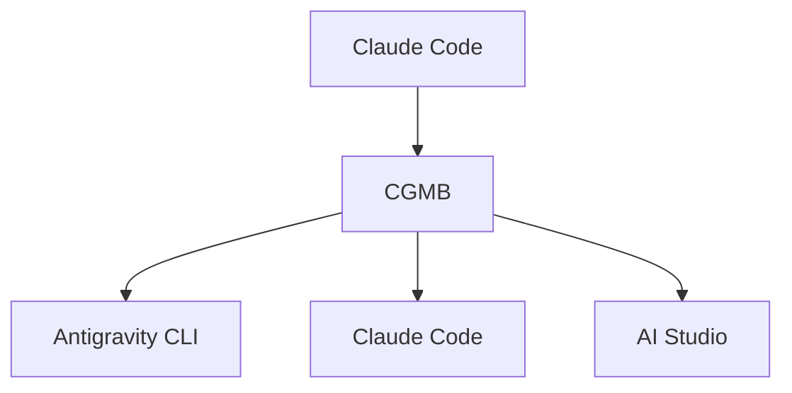

<div align="center">

# 🌉 Claude-Gemini Multimodal Bridge

### *AIの力を、ひとつに。*

**Claude Code、Antigravity CLI、Google AI Studioをシームレスに統合するMCPブリッジ**

[🇺🇸 English](README.md) • [📦 NPM](https://www.npmjs.com/package/claude-gemini-multimodal-bridge) • [🐛 Issues](https://github.com/goodaymmm/claude-gemini-multimodal-bridge/issues)

---

[](https://www.npmjs.com/package/claude-gemini-multimodal-bridge)
[](https://opensource.org/licenses/MIT)
[](https://nodejs.org/)
[](https://www.typescriptlang.org/)

[](https://modelcontextprotocol.io/)
[](https://ai.google.dev/)
[](https://www.anthropic.com/)
[](https://github.com/sponsors/goodaymmm)

[](#-windows環境)
[](#-クイックスタート)
[](#-クイックスタート)

</div>

---

## 🤔 なぜ CGMB？

<table>
<tr>
<td width="33%" align="center">

### 🔄 マルチモデルオーケストレーション

Claude の**推論力**、Antigravity CLI の**検索力**、AI Studio の**生成力**を最適に統合。2026年のAIトレンド「専門AIの協調」を先取り

</td>
<td width="33%" align="center">

### ⚡ インストール1回、セットアップ2手順

`npm install -g` で MCP 統合まで完了。その後 `agy` の導入と AI Studio API キーの設定が必要です

</td>
<td width="33%" align="center">

### 🎯 MCP標準対応

Anthropic Model Context Protocol準拠。148件のテストを Linux / Windows / macOS の CI で push ごとに実行

</td>
</tr>
</table>

---

## ✨ v1.2.1 の修正

| 修正 | 説明 |
|------|------|
| 🎯 **応答が依頼した呼び出し元へ届く** | AI Studio への並行リクエストが互いの応答を受け取っていました |
| 🚪 **`cgmb` が処理後に終了する** | 共有 MCP サーバを起動したまま放置せず、確実に終了させます |
| 🔑 **`.env` は自分のプロジェクトから読む** | インストール先や `~/.cgmb` は既定では読まず、`CGMB_ENV_PATH` で明示指定 |
| 🔍 **検索キャッシュが尋ねた質問に答える** | 年違い・モデル違いを同一エントリとして扱わなくなりました |
| 🧩 **ワークフローの各ステップが入力を受け取る** | parallel が出力を publish し、hybrid が `dependsOn` の順序を守ります |

### v1.2.0 の新機能

| 機能 | 説明 |
|------|------|
| 🔄 **Antigravity CLI** | 検索レイヤーが提供終了した Gemini CLI から `agy` へ移行 |
| 🖥️ **3OS 対応** | Linux / Windows / macOS を push ごとに CI で検証 |
| 🚀 **モデル更新** | `gemini-3-pro-image` / `gemini-3.1-flash-tts-preview`。提供終了した `gemini-2.0-flash-exp` は除去 |
| 🎯 **`targetLayer` が機能** | 指定したレイヤーへ届きます（`claude` も指定可能に） |
| 🔧 **`CLAUDE_CODE_PATH`** | ドキュメントどおり実行ファイル探索に反映されるようになりました |
| 🪟 **Windows完全対応** | CLI/MCP両方でネイティブサポート（v1.1.0 以降） |
| 🔐 **OAuth認証** | `agy` は OS キーリング、Claude Code はファイルベース認証 |
| 📊 **スマートルーティング** | PDF URLはAI Studioへ、WebページはAntigravity CLIへ |

---

## 🏗️ アーキテクチャ


```mermaid
flowchart TD
    A[Claude Code] --> B[CGMB]

    B --> C[Antigravity CLI]
    B --> D[Claude Code]
    B --> E[AI Studio]
```

| レイヤー | 得意分野 | タイムアウト |
|:--------:|:---------|:-----------:|
| 🔍 Antigravity CLI (`agy`) | Web検索、リアルタイム情報 | 90秒 |
| 🧠 Claude Code | 複雑な推論、コード分析 | 300秒 |
| 🎨 AI Studio | 画像生成、音声合成、OCR | 300秒 |

---

## 🚀 クイックスタート

### 📋 前提条件

- **Node.js** ≥ 22.0.0
- **Claude Code CLI** インストール済み
- **Antigravity CLI** (`agy`) 1.1.7 以上 — 別途インストールが必要（下記参照）

### 📦 インストール

```bash
npm install -g claude-gemini-multimodal-bridge
```

> 💡 postinstallスクリプトが自動で:
> - Antigravity CLI の有無を確認し、未導入ならインストール手順を表示
> - Claude Code MCP統合をセットアップ
> - `.env` テンプレートを作成
> - システム要件を検証

### 🔑 環境設定

作業ディレクトリに `.env` ファイルを作成:

```bash
AI_STUDIO_API_KEY=your_api_key_here
```

🔗 APIキー取得: https://aistudio.google.com/app/apikey

### 🎯 Antigravity CLI のセットアップ

Google は 2026-06-18 に Gemini CLI の個人向け提供を終了しました。検索レイヤーは
後継の Antigravity CLI (`agy`) で動作します。npm では配布されていないため、
別途インストールしてください:

```bash
# Windows (PowerShell)
irm https://antigravity.google/cli/install.ps1 | iex

# macOS / Linux
curl -fsSL https://antigravity.google/cli/install.sh | bash
```

インストール後、一度だけ起動してサインインします。ブラウザが開き、OAuth トークンは
OS のキーリングに保存されます。API キーも `agy auth` サブコマンドも存在しません:

```bash
agy
```

`agy models` で確認できます。CGMB は **agy 1.1.7 以上**が必要です
（それ以前のビルドは stdout が端末でない場合に何も出力しません）。

### 💬 Claude Code で使い始める

```
NPMでCGMBをインストールしたので、今の環境からcgmbコマンドを探してください。使い方も教えてください。
```

---

## 💡 使用例

CGMBはClaude Codeとシームレスに統合。**「CGMB」キーワード**を使うだけ:

```bash
# 🎨 画像生成
"CGMBで未来都市のイメージを生成してください"

# 📄 ドキュメント分析（絶対パスを使用）
"CGMBで/full/path/to/report.pdfにあるこの文書を分析してください"

# 🌐 URL分析
"CGMBでhttps://example.com/document.pdfを分析してください"

# 🔍 Web検索
"CGMBで最新のAI情報を検索してください"

# 🎵 音声生成
"CGMBで「ポッドキャストへようこそ」という音声を作成してください"

# 📝 OCR対応PDF解析
"CGMBでこのスキャンされたPDF文書をOCRで解析してください"
```

### 🔄 自動ルーティング

1. Claude Code リクエストに **「CGMB」** を含める
2. CGMB が最適な AI レイヤーに自動ルーティング:
   - **🔍 Antigravity CLI**: Web検索、最新情報
   - **🎨 AI Studio**: 画像、音声、ファイル処理
   - **🧠 Claude Code**: 複雑な推論、コード分析

---

## 🤖 使用モデル一覧

| 用途 | モデルID | レイヤー |
|:----:|:---------|:-------:|
| 🔍 Web検索 | `gemini-3.6-flash-low` | Antigravity CLI |
| 🎨 画像生成 | `gemini-2.5-flash-image` | AI Studio |
| 🖼️ 画像生成（高品質） | `gemini-3-pro-image` | AI Studio |
| 🎵 音声生成 | `gemini-3.1-flash-tts-preview` | AI Studio |
| 📄 ドキュメント処理 | `gemini-2.5-flash` | AI Studio |
| 📝 OCR/テキスト抽出 | `gemini-2.5-flash` | AI Studio |
| 🔮 汎用マルチモーダル | `gemini-2.5-flash` | AI Studio |

Antigravity のモデル ID は `agy models` の出力に存在するものだけが有効です。
AI Studio 側の ID は `src/core/types.ts` の `AI_MODELS` にあります。

---

## 📈 パフォーマンス

ベンチマーク値ではなく、実装が実際に行っていることです:

| 仕組み | 効く場面 | 調整 |
|--------|----------|------|
| 検索結果キャッシュ | 同じ Web 検索プロンプトの繰り返し | `ENABLE_CACHING` / `CACHE_TTL` / `MAX_CACHE_ENTRIES` |
| 認証キャッシュ | `agy` と Claude Code の認証確認を毎回ではなく数時間単位で | — |
| レイヤーの遅延初期化 | 起動時ではなく最初の利用時にレイヤーを起動 | — |
| 指数バックオフ付きリトライ | API や CLI の一時的な失敗 | `MAX_RETRIES` / `RETRY_DELAY` |

実際の速度はどのレイヤーが応答するかと上流 API に依存するため、固定の数値は
掲げていません。

---

## 📄 PDF処理 & OCR

### ✨ OCR機能

- ✅ テキストベースとスキャンPDF両対応
- ✅ OCR必要性を自動検出
- ✅ Gemini File APIでネイティブOCR処理
- ✅ 多言語サポート

### 📋 処理ワークフロー

```
PDF入力 → アップロード → OCR処理 → コンテンツ分析 → 結果出力
```

### 📁 サポート形式

- テキストベースPDF
- スキャンPDF（OCR処理）
- 画像ベースPDF（OCR変換）
- 混合コンテンツ
- 複雑なレイアウト（表、グラフ、フォーマット済みコンテンツ）

---

## 📂 ファイル構成

生成されたコンテンツは自動的に整理:

```
output/
├── images/     # 🎨 生成された画像
├── audio/      # 🎵 生成された音声ファイル
└── documents/  # 📄 処理されたドキュメント
```

ファイルは CGMB を実行した作業ディレクトリ配下に書き出され、生成された
ファイルのパスは応答に含まれます。

CGMB が Claude Code に公開する MCP ツールは `cgmb`、
`cgmb_get_layer_requirements`、`cgmb_document_analysis`、
`cgmb_multimodal_process`、`cgmb_workflow_orchestration` の5つです。

---

## 🔧 設定

### 環境変数

```bash
# 必須
AI_STUDIO_API_KEY=your_api_key_here

# 検索レイヤー (Antigravity CLI)
ANTIGRAVITY_MODEL=gemini-3.6-flash-low   # `agy models` に存在するもののみ
ANTIGRAVITY_TIMEOUT=90000                # 1回あたりのタイムアウト (ms)
ANTIGRAVITY_CLI_PATH=                    # 未設定なら自動検出

# Claude レイヤー
CLAUDE_CODE_PATH=/usr/local/bin/claude   # 既定の場所以外にある場合

# キャッシュ・ログ
ENABLE_CACHING=true
CACHE_TTL=3600
LOG_LEVEL=info

# AI_STUDIO_API_KEY の非推奨フォールバック（前者を推奨）
GEMINI_API_KEY=your_api_key_here
```

### 🔐 Google へ送信してよいファイルの範囲

AI Studio レイヤーはファイルの内容を Google へアップロードするため、CGMB を
起動したディレクトリからしか読み取りません。それ以外の場所のファイルを扱う
場合は、対象ディレクトリを明示してください:

```bash
# 区切りは Windows が ";"、それ以外は ":"
CGMB_ALLOWED_ROOTS=C:\Users\me\Documents;D:\shared
```

全一覧は `.env.example` にあります。パースされるだけで誰も読まない項目も
明記してあるので、設定が効くかどうかは先にそちらを確認してください。

### MCP統合

CGMBは自動的にClaude Code MCP統合を設定:
- 📍 設定パス: `~/.claude-code/mcp_servers.json`
- ⚡ 直接Node.js実行
- 🔒 既存サーバーを上書きしない安全なマージ

---

## 🪟 Windows環境

CGMB は v1.1.0 以降 Windows 環境を**完全サポート**しています:

| 機能 | 状態 |
|------|:----:|
| CLI | ✅ すべてのコマンドが動作 |
| MCP統合 | ✅ MCPツール呼び出しが正常動作 |
| パス解決 | ✅ `C:\path\to\file` 形式を自動処理 |
| Antigravity CLI | ✅ Windows版との完全な互換性 |

```powershell
# パスは絶対パスを推奨
cgmb analyze "C:\Users\name\Documents\report.pdf"

# 環境変数の設定（PowerShell）
$env:AI_STUDIO_API_KEY = "your_api_key_here"

# 環境変数の設定（コマンドプロンプト）
set AI_STUDIO_API_KEY=your_api_key_here
```

---

## 🐧 Linux / WSL環境

CGMBはLinuxおよびWSL環境で**完全に動作**:

| 機能 | 状態 |
|------|:----:|
| CLI | ✅ すべてのコマンドが動作 |
| MCP統合 | ✅ MCPツール呼び出しが正常動作 |
| パス解決 | ✅ `/mnt/` WSLパス、Unixパス対応 |
| Antigravity CLI | ✅ Linux版との完全な互換性 |

```bash
# Unixパス形式で使用
cgmb analyze /home/user/documents/report.pdf

# WSL環境での例
cgmb analyze /mnt/c/Users/name/Documents/report.pdf

# 環境変数の設定
export AI_STUDIO_API_KEY="your_api_key_here"
export ANTIGRAVITY_MODEL="gemini-3.6-flash-low"
```

### WSLでのテスト実行

テストはプラットフォームを判別し、両環境で同数のケースを実行します。Windows専用の
ケース（`.cmd` シムの扱い）にはPOSIX版が対になっており、POSIX専用のケース
（シグナルによる終了、`/mnt/c/Users` の探索）はWindowsではスキップされます。

```bash
cd /mnt/<drive>/path/to/claude-gemini-multimodal-bridge
node --version        # engines.node (>= 22) を満たすこと
npm run build         # ホスト側でビルド済みならそれを流用してもよい
node --test "tests/**/*.test.mjs"
```

---

## 🔍 トラブルシューティング

### デバッグモード

```bash
export CGMB_DEBUG=true
export LOG_LEVEL=debug
cgmb serve --debug
```

### OCRとPDF処理の問題

**OCR結果が不正確な場合:**
- 高解像度スキャンPDF（300+ DPI）を使用
- 明瞭で高コントラストなテキストを確保
- 傾きや回転した文書を避ける

**大きな文書でタイムアウトする場合:**
- 処理前に大きなPDFを分割（制限: 50MB、1,000ページ）
- AI Studio レイヤーの 300 秒は固定で、延長する環境変数はありません。
  分割が唯一の対処です

---

## 💰 APIコスト

CGMBは従量課金制APIを使用:
- 📊 [Google AI Studio API 料金詳細](https://ai.google.dev/pricing)

---

## 📁 プロジェクト構造

```
src/
├── core/           # 🎯 メインMCPサーバーとレイヤー管理
├── layers/         # 🔌 AIレイヤー実装
├── auth/           # 🔐 認証システム
├── tools/          # 🛠️ 処理ツール
├── utils/          # 🔧 ユーティリティとヘルパー
└── mcp-servers/    # 🌐 カスタムMCPサーバー
```

---

## 🔗 リンク

<table>
<tr>
<td>

### 📦 プロジェクト
- [GitHub](https://github.com/goodaymmm/claude-gemini-multimodal-bridge)
- [NPM](https://www.npmjs.com/package/claude-gemini-multimodal-bridge)
- [Issues](https://github.com/goodaymmm/claude-gemini-multimodal-bridge/issues)

</td>
<td>

### 🔧 関連ツール
- [Claude Code](https://docs.anthropic.com/en/docs/claude-code)
- [Antigravity CLI](https://antigravity.google/docs/cli)
- [Google AI Studio](https://aistudio.google.com/)
- [MCP](https://modelcontextprotocol.io/)

</td>
<td>

### 📜 利用規約
- [Google AI Studio](https://ai.google.dev/gemini-api/terms)
- [Claude](https://www.anthropic.com/terms)
- [Gemini API](https://ai.google.dev/gemini-api/docs/safety-guidance)

</td>
</tr>
</table>

---

## 📜 バージョン履歴

### v1.2.1 (2026-08-02)

修正のみのリリースです。すべて 1.2.0 で実測された欠陥への対応で、機能追加は
ありません。変更は 18 ファイルに収まっています。

- 🎯 **AI Studio への並行リクエストが互いの応答を取らなくなりました**: 共有 MCP
  サーバに対して呼び出しごとに stdout リスナーを足し、最初に見えた応答で確定して
  いたため、2 つの呼び出しが同じ応答を受け取っていました。リクエスト ID も
  `Date.now()` で、同一ミリ秒の 2 件は衝突します。ID で応答を振り分け、ID は単調に
  なり、TTL で交代したプロセスが後任を巻き込んで失敗させることもなくなりました
- 🚪 **AI Studio 利用後に `cgmb` が終了します**: 共有 MCP サーバを終了する手段が
  なく、その stdio パイプが親プロセスを生かし続けていました。shutdown で確実に
  終了させ、さらに shell を経由せずに起動するため、終了処理が中間の shell ではなく
  サーバ本体に届きます
- 🔑 **`.env` はインストール先ではなくプロジェクトから読みます**: 既定でインストール
  ディレクトリ・グローバル npm ディレクトリ・`~/.cgmb` を読んでいました。他プロジェクト
  の `AI_STUDIO_API_KEY` に加え、**Google へ送ってよいファイルを決める
  `CGMB_ALLOWED_ROOTS`** まで引き込む点がより深刻です。これらは `CGMB_ENV_PATH` に
  よる明示指定のみとし、同変数はファイル・ディレクトリのどちらも受け付け、既定の
  探索先より優先されます
- 🔍 **検索キャッシュが尋ねた質問に答えます**: キーが 2024〜2029 年をすべて同一視し、
  「最新」「最近」「新しい」を畳み込み、モデルを含めていませんでした。2026 年の質問に
  2024 年の回答が返る、別モデルの回答が返る、といった誤りが起きていました
- 🧩 **ワークフローの各ステップが入力を受け取ります**: parallel が出力を publish せず、
  下流ステップが参照先の値なしで動いたうえ success を返していました。hybrid は
  `dependsOn` の順序を無視していました
- ⏱️ **タイムアウトが実際の処理量を反映します**: Claude の一般経路がレイヤー既定を
  下回る固定値を下限にし、見積りも実際に送るプロンプトを見ていませんでした
- 🔊 **提供終了モデル ID を除去**: 音声経路に `gemini-2.0-flash` が直書きされていました
- 🧪 **CI がテスト全体を実行します**: postinstall スクリプトが CI 環境でモジュール
  スコープから `process.exit(0)` していたため、これを `require` したプロセスごと
  終了していました。GitHub Actions 上でテスト 5 件が消えたまま緑になっていました

**削除**: `generate-audio --script`。「原稿を生成してから読み上げる」2 段階処理を
うたっていましたが、第 1 段が AI Studio サーバに存在しない `generate_text` ツールを
要求するため、本バージョン以前のすべてで `MCP error -32601` を返していました。
`--help` にのみ現れ、本 README にも `docs/` にも記載はありません。通常の
`generate-audio` は影響を受けません。2 段階処理は、検証できるリリースで作り直します。

**既知・未修正**: `audio_analysis_advanced` タスク種別が、サーバに実装のない
`analyze_audio_advanced` を呼びます。CLI からも MCP ツールからも到達できないため、
現状これを起動する手段はありません。

### v1.2.0 (2026-07-28)
- 🔄 **Antigravity CLI へ移行**: Google が 2026-06-18 に Gemini CLI の個人向け提供を
  終了したため、Web検索レイヤーは `agy` (Antigravity CLI 1.1.7 以降) を呼びます。
  認証は API キーではなく OS キーリング経由です。レイヤー名は `antigravity` が正準で、
  `gemini` も別名として引き続き使えます
- 🚀 **AI Studio モデル更新**: 高品質な画像生成に `gemini-3-pro-image`、音声生成に
  `gemini-3.1-flash-tts-preview` を採用。提供終了した `gemini-2.0-flash-exp` は
  直書きされていた6箇所すべてから除去しました
- 🖥️ **3OS 対応**: Linux / Windows / macOS を push ごとに CI で検証しています
- 🎯 **`targetLayer` が機能するように**: レイヤーを指定すればそこへ届きます。`claude`
  も指定可能になり、指定したのに別レイヤーが応答する挙動を修正しました
- 🔧 **`CLAUDE_CODE_PATH` が有効に**: 環境変数と `claude.code_path` が実行ファイルの
  探索に届くようになり、既定の場所以外のインストールも使えます
- 🧹 **デッドコード削除**: どこからも import されていなかったワークフロークラス
  3,619行を削除。公開 API の表面に変更はありません

### v1.1.0 (2026-01-10)
- 🪟 **Windows完全対応**: CLI/MCP両方でWindowsをネイティブサポート
- 📝 **OCR機能強化**: 画像ベースPDFの自動OCR処理
- 🚀 **Gemini最新モデル**: gemini-2.5-flash 対応
- ⚡ **MCP統合改善**: 非同期レイヤー初期化の最適化
- 📈 **パフォーマンス向上**: タイムアウト短縮、遅延読み込み、キャッシング強化
- 🛡️ **エラー回復**: 指数バックオフによる95%の自己修復率

### v1.0.4
- 🎉 初期リリース
- 🏗️ 3層アーキテクチャ実装
- 🎨 基本的なマルチモーダル処理

---

<div align="center">

## 📄 ライセンス

MIT - [LICENSE](LICENSE) を参照

---

**Made with ❤️ by [goodaymmm](https://github.com/goodaymmm)**

*⭐ このプロジェクトが役に立ったら、スターをお願いします！*

[](https://github.com/sponsors/goodaymmm)

</div>
